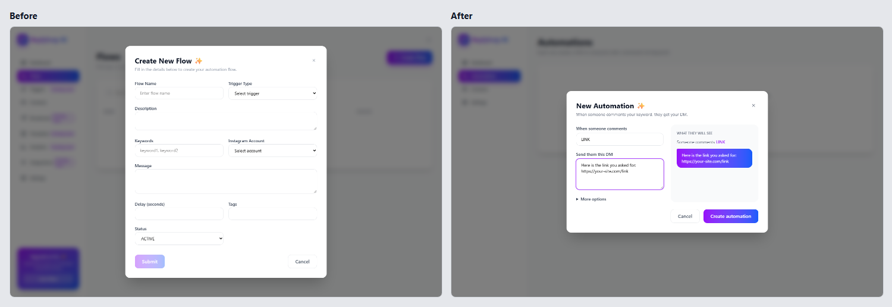
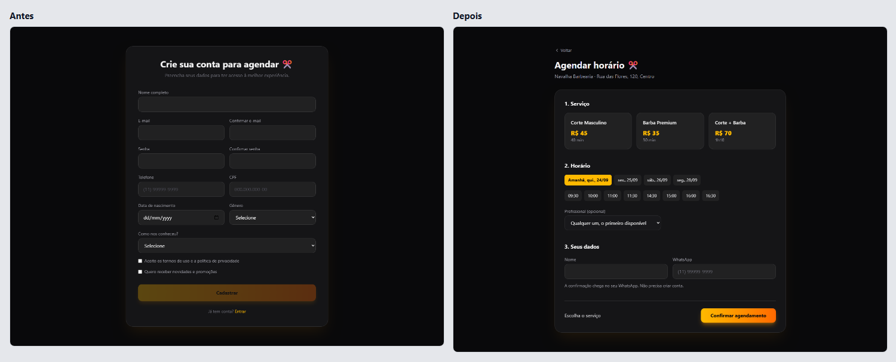
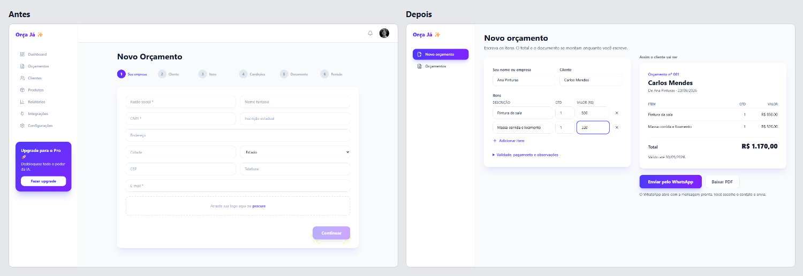
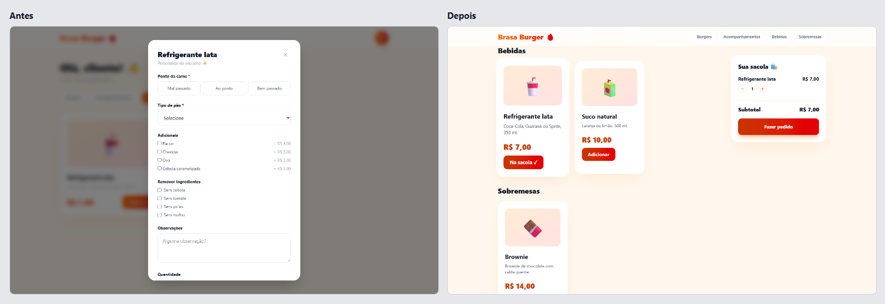

# Phyll

Revisão de UX para apps feitos com IA, dentro do agente que você já usa.

[Read in English](README.md)

O Phyll percorre o seu app como alguém que chega pela primeira vez. Ele junta capturas de tela, medidas tiradas da página e os cliques que cada tarefa exigiu, e aponta o que torna o produto difícil de entender ou de usar. Ele conhece os vícios que os geradores de código deixam, na aparência e no jeito como os fluxos funcionam, e pode corrigir tudo para você.

O Phyll mantém o seu design. Cores, gradientes, fontes e layout ficam como estão. As mudanças vão para onde as pessoas travam: formulários que pedem mais do que a tarefa precisa, etapas que cabem numa tela só, botões que não levam a lugar nenhum e textos claros demais para ler.

A revisão roda no Codex ou no Claude Code, na sua própria assinatura. O Phyll acrescenta um navegador, um scanner e o motor de revisão, e nunca cobra tokens de IA.

Para testar sem conta, rode o scanner no seu projeto. Ele dá um índice de cara de IA de 0 a 100, quanto menor melhor, e aponta cada sinal pelo arquivo e pela linha:

```bash
npx phyll scan
```



O mesmo app, uma ferramenta no estilo do ManyChat para criadores do Instagram, antes e depois da revisão. A revisão do lado esquerdo está em [examples/dm-automation/review/report.md](examples/dm-automation/review/report.md): 12 achados, índice de cara de IA de 79 e uma primeira tarefa que não dava para terminar.

## Comece

Crie uma conta grátis em [agentphyll.com](https://agentphyll.com), ou pelo terminal, e ligue o Phyll ao seu agente:

```bash
npx phyll signup voce@exemplo.com
npx phyll setup codex        # ou claude, cursor, windsurf, gemini
```

Depois peça ao agente: "revise meu app em http://localhost:3000". Ele abre o app, percorre as tarefas principais, escreve o relatório em `.phyll/reports/<hora>/` e devolve um link para ele.

Todos os relatórios, as suas chaves e o seu plano também ficam em [agentphyll.com/account](https://agentphyll.com/account), e o `npx phyll account` abre essa página já com a sua conta conectada. Se perder a chave, entre lá com o seu e-mail e crie uma nova.

Já tem conta? O `npx phyll login` conecta este computador: você permite no navegador, e o terminal ganha uma chave própria. Todos os comandos, com exemplos, estão em [agentphyll.com/commands](https://agentphyll.com/commands).

No Claude Code você também pode instalar o plugin, que acrescenta `/phyll:review`, `/phyll:fix` e `/phyll:scan`:

```
/plugin marketplace add carlosphyll/phyll
/plugin install phyll@carlosphyll
```

O plugin inicia o conector sozinho, então com ele você pula o `npx phyll setup claude`. Você precisa do Node 20 ou mais novo. O `setup` instala o Chromium que o navegador do Phyll usa. Para um agente fora da lista, o `npx phyll setup other` mostra a entrada MCP para colar nas configurações dele.

## Grátis e Phyll Pro

| | Grátis | Phyll Pro, R$ 9 por mês |
| --- | --- | --- |
| O scanner do código, aqui e na integração contínua | Sem limite | Sem limite |
| Revisões completas no seu agente, com correções | 5 | Sem limite |
| Um link para cada relatório, histórico, antes e depois | Sim | Sim |
| Pacotes de regras especializadas | Não | Conforme forem saindo |

O preço é em reais, e o checkout mostra o valor na moeda de quem paga. `npx phyll pro` abre o checkout, e `npx phyll billing` troca o cartão ou cancela. O trabalho de IA sempre roda na assinatura do seu agente.

## Quatro apps, antes e depois

Cada exemplo é um app pequeno escrito como um gerador de código costuma escrever, o mesmo app depois da revisão e a revisão completa da primeira versão. Três deles são negócios brasileiros, revisados em português.

| Exemplo | A primeira tarefa | Campos | Cliques | Índice de cara de IA | Estilo mantido |
| --- | --- | --- | --- | --- | --- |
| [Replyloop](examples/dm-automation) | Mandar uma DM para quem comenta uma palavra-chave | 9 antes, 2 depois | 9 antes, 3 depois | 75 antes, 7 depois | 10 de 10 traços |
| [Navalha Barbearia](examples/booking) | Marcar um corte | 20 antes, 4 depois | 18 antes, 4 depois | 54 antes, 6 depois | 9 de 9 traços |
| [Orça Já](examples/quote) | Fazer um orçamento e mandar para o cliente | 41 antes, 4 depois | 10 antes, 2 depois | 66 antes, 6 depois | 9 de 10 traços |
| [Brasa Burger](examples/menu) | Pedir um hambúrguer para entrega | 33 antes, 4 depois | 15 antes, 5 depois | 53 antes, 6 depois | 8 de 8 traços |

Campos e cliques contam o que alguém que chegava pela primeira vez precisou fazer na primeira tarefa, e nenhum dos apps de antes levava essa pessoa até o resultado. O índice de cara de IA vem do scanner, e quanto menor, melhor. Estilo mantido conta os traços visuais do app de antes, como gradientes, vidro e emoji, que continuam lá depois das correções.







Cada pasta de exemplo tem a revisão em `review/report.md` e mais comparações em `screenshots/`. O arquivo [examples/README.pt-BR.md](examples/README.pt-BR.md) explica como rodar os apps.

## O que ele encontra

- **Propósito.** Uma primeira tela que não diz o que o produto faz, uma página de vendas na frente da ferramenta, um painel de números inventados para quem acabou de se cadastrar.
- **Fluxo.** Um login antes do cardápio, um CPF para marcar um corte, 39 campos para um orçamento, um modal para tudo, botões que não fazem nada, um "Sucesso!" que não leva a lugar nenhum.
- **Ações.** O botão principal longe do conteúdo em que ele age, botões de ícone sem nome, excluir sem desfazer, ações que só aparecem com o mouse em cima, escolhas que o teclado não alcança.
- **Aparência.** Texto cinza abaixo do contraste mínimo, texto branco em botão laranja claro, layouts que quebram no celular. Gradientes, vidro, emoji e heróis centralizados entram como notas de estilo e ficam como estão.
- **Texto.** "Turbine seu fluxo de trabalho", "Comece agora", "Mais de 10 mil clientes", João da Silva, `COMMENT_KEYWORD` na tela, "Algo deu errado".
- **Estados.** Estados vazios que só dizem "Sem dados", erros que só chegam ao console, uma confirmação que mostra o horário de outra pessoa, foco do teclado invisível.

Cada um deles é um dos 57 sinais do catálogo do Phyll. O catálogo em forma de dados, com os detectores que acham sinais no código, está em [skills/phyll/data/tells.json](skills/phyll/data/tells.json), e os testes conferem cada detector contra código de verdade e contra os quatro apps de exemplo.

## Como uma revisão funciona

1. **Enquadrar.** O seu agente descobre quem usa o produto e as duas ou três tarefas que essas pessoas vêm fazer.
2. **Juntar evidências.** O Phyll varre o código, captura cada tela em tamanho de notebook e de celular e roda na página uma sonda que mede contraste, tamanho e posição dos botões e os campos dos formulários. Depois o seu agente percorre cada tarefa como alguém novo e conta cliques, telas e becos sem saída.
3. **Julgar.** Os achados se dividem em seis dimensões, com base em princípios como a lei de Fitts, as heurísticas de Nielsen e as WCAG, e são ordenados pelo quanto travam quem usa. Para cada tarefa, a revisão também compara os campos e cliques pedidos com o que a tarefa precisa, e marca o que pode ter um padrão, ficar para depois ou sair.
4. **Relatório.** O motor do Phyll confere o relatório, dá a nota e guarda tudo com um link. Você recebe o `report.md`, que abre com os três achados que mais travam as pessoas e uma tabela do que dá para cortar. O relatório também traz um índice de cara de IA de 0 a 100, que você vê cair.
5. **Corrigir, quando você pedir.** O seu agente aplica as correções um achado por vez, com um commit e uma captura de antes e depois para cada um. Botões e mensagens novos usam as classes do próprio produto, e o design fica.

## O scanner, grátis e sozinho

O scanner procura sinais de IA no código, sem conta e sem IA:

```bash
npx phyll scan .
```

Quando o índice estiver baixo, o `npx phyll scan . --format badge` gera um selo com ele para o seu README.

O repositório também é uma GitHub Action, que varre cada pull request e mostra o índice de cara de IA no resumo do job:

```yaml
- uses: actions/checkout@v4
- uses: carlosphyll/phyll@v0.4.5
  with:
    path: .
    fail-above: 40
```

O `fail-above` é opcional. Sem ele, o job mostra o índice e nunca falha.

## O que sai do seu computador

O seu código, as suas capturas de tela e a conversa com o seu agente ficam no seu computador. Quando uma revisão começa, o conector manda ao motor do Phyll o endereço do app, o nome do projeto e um resumo da varredura: quais sinais apareceram, quantas vezes, e os caminhos das rotas e dos formulários. Quando a revisão termina, ele manda o `report.json`, com os achados que o seu agente escreveu, que o motor guarda para o link funcionar. Nada além disso é enviado, e o scanner não envia nada.

## O que tem neste repositório

- `packages/connector`: o pacote `phyll` do npm. Os comandos, e o servidor MCP que o seu agente inicia, com o navegador, a sonda e o scanner.
- `skills/phyll`: a skill que ensina os agentes a usar o conector, o código do scanner e o catálogo em forma de dados.
- `examples`: os quatro apps, as revisões e as comparações.
- `action.yml`: a GitHub Action da varredura.

O método de revisão e o motor rodam no servidor do Phyll e não estão neste repositório.

## Como contribuir

A contribuição mais útil é um sinal que você vive encontrando em apps gerados, com um exemplo que mostre o problema. O [CONTRIBUTING.md](CONTRIBUTING.md) explica como acrescentar um detector; os testes conferem se ele pega o seu exemplo. Um app de exemplo novo também ajuda. Relatos de bugs e suporte a mais frameworks são bem-vindos.

## Licença

MIT, inclusive para uso comercial. O nome e o logo do Phyll não entram na licença; veja o [TRADEMARK.md](TRADEMARK.md).
