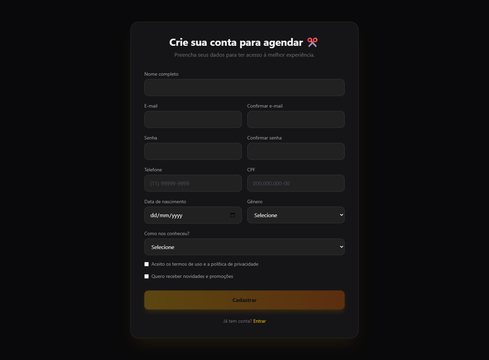
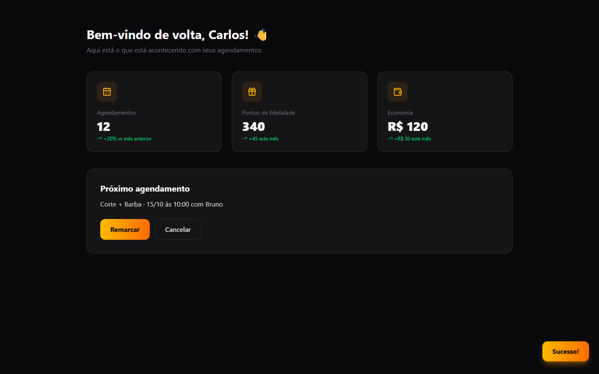
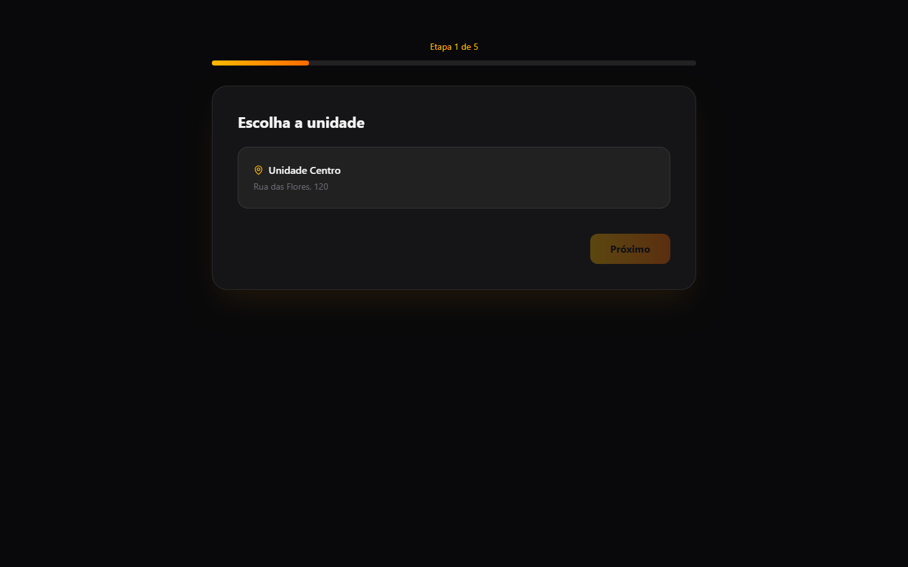
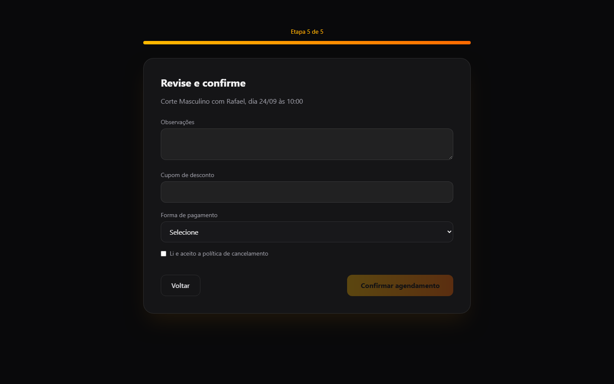
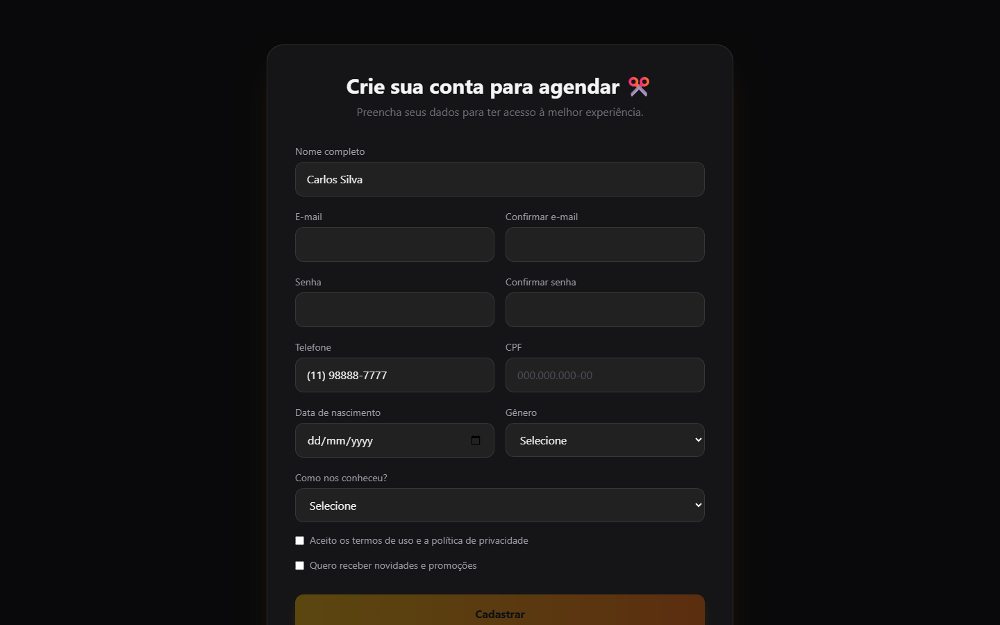
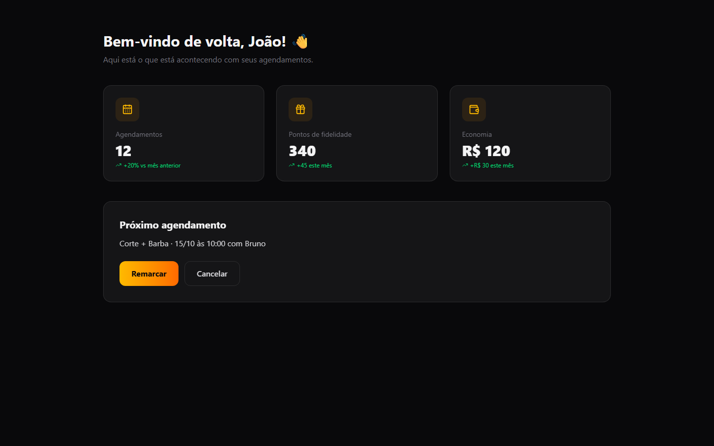

# Revisão do Phyll: Navalha Barbearia (antes)

2026-09-23 · revisão completa · http://localhost:5175

| Índice de cara de IA | Campos pedidos / necessários | Revisão anterior | Achados |
| --- | --- | --- | --- |
| **50/100** | 20 / 4 | nenhuma | bloqueador: 2, grave: 5, menor: 3, acabamento: 1 |

Quanto menor, melhor. O índice conta quantos sinais de IA diferentes atrapalham quem usa o produto, com peso maior para os que atrapalham mais.

Notas de estilo: 9 sinais da aparência gerada (índice de estilo 66/100). O Phyll aponta e deixa o design visual como está.

## O que mais trava quem usa

1. **UX-01: Um cadastro de 12 campos antes de ver qualquer horário** (bloqueador, fluxo). Quem chega pelo Instagram quer saber se tem horário amanhã. Um cadastro desse tamanho antes da agenda faz a pessoa desistir e mandar mensagem, ou procurar outra barbearia. CPF e data de nascimento ainda pedem uma confiança que o site não conquistou. Correção: Abra direto o agendamento, sem conta. Peça só nome e WhatsApp, no fim da mesma página.
2. **UX-02: Depois de marcar, a conta mostra outro agendamento** (bloqueador, estados). A confirmação é o momento em que o cliente precisa de certeza. Com outro serviço, outra data e outro barbeiro na tela, ele acha que marcou errado e liga para conferir. Correção: Troque o aviso Sucesso! por uma tela de confirmação com o que foi marcado: serviço, dia, hora, profissional e endereço. Ponha nela Adicionar à agenda, Remarcar e Falar com a barbearia. Tire os números fixos da conta.
3. **UX-03: Cinco etapas para um agendamento que cabe em uma tela** (grave, fluxo). No celular, cada etapa é mais um toque e mais uma tela. A escolha de unidade não decide nada, e o profissional obrigatório trava quem não tem preferência. Correção: Junte serviço, horário e dados em uma página. Tire a unidade, deixe o profissional opcional em qualquer um e mostre só os próximos dias com horário livre, já com os horários à vista.

## Teste dos cinco segundos

- O que é isto? Uma barbearia, pelo nome e pela tesoura. O título fala em transformar o visual e em experiência premium, sem dizer onde fica.
- Para quem é? Quem corta cabelo e faz barba, pelos serviços listados mais abaixo.
- O que eu faço agora? Agende agora. Saiba mais não leva a lugar nenhum.
- Resultado: passou. Por pouco. Dá para entender que é uma barbearia e que o site marca horário, mas não onde ela fica nem quanto custa um corte.

## Jornadas

| Tarefa | Cliques | Telas | Becos sem saída | Chegou ao objetivo |
| --- | --- | --- | --- | --- |
| J1. Marcar um horário | 18 | 4 | 0 | não |
| J2. Remarcar ou cancelar um horário | 2 | 1 | 2 | não |

J1: O cliente chega ao fim, mas a tela mostra outro agendamento, e ele não tem como saber se o corte foi marcado.

J2: Remarcar e cancelar ainda não existem, e o site não mostra telefone nem WhatsApp da barbearia para resolver de outro jeito.

## O que dá para cortar

O que cada tarefa pede, comparado com o que ela precisa para chegar ao objetivo. Todo corte mantém o design como está.

| Tarefa | Campos pedidos | Campos necessários | Cliques hoje | Cliques necessários |
| --- | --- | --- | --- | --- |
| J1. Marcar um horário | 20 | 4 | 18 | 4 |

J1. Marcar um horário

- E-mail e Confirmar e-mail: remover. A confirmação vai pelo WhatsApp.
- Senha e Confirmar senha: remover. Marcar um corte não precisa de conta.
- CPF, data de nascimento e gênero: remover. Nenhum passo do agendamento usa esses dados.
- Como nos conheceu: pedir depois. Se a barbearia quiser saber, pergunte depois de marcar, sem obrigar.
- Termos de uso: remover. Sem conta, não há termo para aceitar. Uma linha dizendo que o WhatsApp serve para a confirmação basta.
- Quero receber novidades: pedir depois. Pode aparecer na confirmação, desmarcado.
- Unidade: deduzir. Só existe uma.
- Profissional: usar um padrão. Comece em qualquer um, o primeiro disponível. Quem tem preferência troca.
- Observações: pedir depois. O cliente fala com o barbeiro na cadeira. Se fizer falta, vira um campo opcional depois de marcar.
- Cupom de desconto: remover. Não existe cupom ativo, e um campo vazio manda o cliente procurar um fora do site.
- Forma de pagamento: remover. O pagamento é feito na barbearia.
- Política de cancelamento: remover. Escreva a regra em uma linha perto do botão, sem caixa para marcar.
- Nome completo: manter. O primeiro nome já basta para chamar o cliente.
- Telefone: manter. Vira o campo de WhatsApp, por onde chega a confirmação.

## Todos os achados

### UX-01. Um cadastro de 12 campos antes de ver qualquer horário

Bloqueador · fluxo · esforço M · sinais F05, F02, F11, F12

Evidência:

- S2 (screens/desktop-cadastro.png): O primeiro clique em Agende agora abre um cadastro com e-mail duas vezes, senha duas vezes, CPF, data de nascimento, gênero e como conheceu a barbearia.
- S1: Os dois botões Agende agora da página inicial levam ao cadastro.

Por que atrapalha: Quem chega pelo Instagram quer saber se tem horário amanhã. Um cadastro desse tamanho antes da agenda faz a pessoa desistir e mandar mensagem, ou procurar outra barbearia. CPF e data de nascimento ainda pedem uma confiança que o site não conquistou. Princípio: Valor antes do cadastro.

Correção: Abra direto o agendamento, sem conta. Peça só nome e WhatsApp, no fim da mesma página.

Arquivos: `examples/booking/before/src/pages/Signup.jsx`, `examples/booking/before/src/pages/Landing.jsx`

### UX-02. Depois de marcar, a conta mostra outro agendamento

Bloqueador · estados · esforço M · sinais S04, C04, P03, L07

Evidência:

- S4 (screens/desktop-minha-conta-apos-agendar.png): Depois de marcar Corte Masculino no dia 24/09 às 10:00 com Rafael, o próximo agendamento mostrado é Corte + Barba em 15/10 às 10:00 com Bruno.
- S4 (screens/desktop-minha-conta.png): Sem cadastro, a página cumprimenta João e mostra 12 agendamentos, 340 pontos e R$ 120 de economia com tendências de alta.

Por que atrapalha: A confirmação é o momento em que o cliente precisa de certeza. Com outro serviço, outra data e outro barbeiro na tela, ele acha que marcou errado e liga para conferir. Princípio: Visibilidade do estado do sistema.

Correção: Troque o aviso Sucesso! por uma tela de confirmação com o que foi marcado: serviço, dia, hora, profissional e endereço. Ponha nela Adicionar à agenda, Remarcar e Falar com a barbearia. Tire os números fixos da conta.

Arquivos: `examples/booking/before/src/pages/Account.jsx`, `examples/booking/before/src/pages/Booking.jsx`, `examples/booking/before/src/App.jsx`

### UX-03. Cinco etapas para um agendamento que cabe em uma tela

Grave · fluxo · esforço M · sinais F07, F09

Evidência:

- S3 (screens/desktop-agendar.png): A etapa 1 de 5 pede para escolher a unidade, e só existe a Unidade Centro. O botão Próximo fica apagado até clicar nela.
- S3 (screens/desktop-agendar-etapa-4.png): A etapa 4 mostra o mês inteiro com 24 dos 30 dias bloqueados. Os horários só aparecem depois de escolher o dia.

Por que atrapalha: No celular, cada etapa é mais um toque e mais uma tela. A escolha de unidade não decide nada, e o profissional obrigatório trava quem não tem preferência. Princípio: Uma tarefa, uma tela.

Correção: Junte serviço, horário e dados em uma página. Tire a unidade, deixe o profissional opcional em qualquer um e mostre só os próximos dias com horário livre, já com os horários à vista.

Arquivos: `examples/booking/before/src/pages/Booking.jsx`

### UX-04. Pagamento, cupom e política obrigatórios num agendamento que não cobra nada

Grave · fluxo · esforço S · sinais F02

Evidência:

- S3 (screens/desktop-agendar-etapa-5.png): A etapa 5 exige forma de pagamento e o aceite da política de cancelamento. A política não tem link, e o site não cobra nada.

Por que atrapalha: O cliente precisa aceitar uma regra que não consegue ler. O campo de cupom vazio faz ele sair para procurar desconto, e a forma de pagamento não muda nada, porque o pagamento é feito na barbearia. Princípio: Pergunte só o que a tarefa usa.

Correção: Tire pagamento, cupom e política do agendamento. Se existir uma regra de cancelamento, escreva em uma linha perto do botão de confirmar.

Arquivos: `examples/booking/before/src/pages/Booking.jsx`

### UX-05. Botões apagados que não dizem o que falta

Grave · ações · esforço S · sinais A07

Evidência:

- S2 (screens/desktop-cadastro-incompleto.png): Com nome e telefone preenchidos, Cadastrar continua apagado e nenhuma mensagem aponta o campo que falta.
- S2: A senha precisa de 8 caracteres e o CPF de 11 dígitos, regras que só existem no código.
- S3: Próximo fica apagado em todas as etapas até a escolha ser feita, sem dizer isso.

Por que atrapalha: O cliente não sabe se o problema é o CPF, a senha curta ou o e-mail diferente do primeiro. Sem pista, ele tenta de novo, desiste ou chama no WhatsApp. Princípio: Ajude a pessoa a sair do erro.

Correção: Deixe o botão sempre ativo. Ao clicar, mostre ao lado de cada campo o que falta, em uma frase, e leve a tela até o primeiro problema.

Arquivos: `examples/booking/before/src/pages/Signup.jsx`, `examples/booking/before/src/pages/Booking.jsx`

### UX-06. Remarcar e Cancelar não funcionam

Grave · ações · esforço S · sinais F01, P05, F04

Evidência:

- S4 (screens/desktop-minha-conta.png): Remarcar não faz nada. Cancelar abre um alerta do navegador com Em breve!.
- S1: O site não mostra telefone nem WhatsApp, e o link Contato do menu não leva a lugar nenhum.

Por que atrapalha: Remarcar e cancelar é o que o cliente mais faz depois de marcar. Sem esses botões e sem um contato, o horário fica preso, e a barbearia perde a cadeira quando ele não aparece. Princípio: Não mostre o que não funciona.

Correção: Faça Remarcar abrir o agendamento com o mesmo serviço e os dados já preenchidos. Enquanto cancelar pelo site não existir, troque o botão por Falar com a barbearia, com link para o WhatsApp.

Arquivos: `examples/booking/before/src/pages/Account.jsx`, `examples/booking/before/src/pages/Landing.jsx`

### UX-07. Texto cinza apagado em quase todas as telas

Grave · aparência · esforço S · sinais L12

Evidência:

- S1: 9 dos 25 textos medidos ficam abaixo de 4,5:1. O cinza zinc-500 dá 4,12:1 no fundo da página e 3,76:1 dentro dos cards.
- S3: O endereço da unidade, Rua das Flores, 120, fica em 3,31:1.

Por que atrapalha: O cliente usa o celular na rua, muitas vezes com o brilho baixo. O que fica cinza é justamente o endereço, a duração e a descrição dos serviços. Princípio: Contraste mínimo de 4,5:1 (WCAG 1.4.3).

Correção: Troque zinc-500 por zinc-400 nos textos de apoio. A paleta e o fundo continuam os mesmos.

Arquivos: `examples/booking/before/src/pages/Landing.jsx`, `examples/booking/before/src/pages/Signup.jsx`, `examples/booking/before/src/pages/Booking.jsx`, `examples/booking/before/src/pages/Account.jsx`

### UX-08. O título não diz onde fica nem o que dá para fazer

Menor · propósito · esforço S · sinais C01, C02, C03

Evidência:

- S1 (screens/desktop-home.png): O título é Transforme seu visual com a melhor experiência premium da cidade. A nota 4.9/5 e os 5.000 clientes não têm fonte, e Saiba mais não abre nada.

Por que atrapalha: O cliente quer saber se a barbearia fica perto, quanto custa e se tem horário. Frases que serviriam para qualquer barbearia não respondem nada, e números sem fonte soam inventados. Princípio: Diga o que é, para quem e o que fazer.

Correção: Diga no título o que é e onde fica, por exemplo Corte e barba no Centro, com horário marcado. Troque a nota pelo endereço e pelo horário de funcionamento, ou mostre a nota real com link para o Google.

Arquivos: `examples/booking/before/src/pages/Landing.jsx`

### UX-09. Links do menu que não levam a lugar nenhum

Menor · ações · esforço S · sinais F01, A08

Evidência:

- S1: Seis links apontam para #: Serviços, Sobre, Contato, Saiba mais, Política de privacidade e Termos de uso.
- S1: No celular, os links do menu têm 20 px de altura, abaixo dos 24 px mínimos para tocar.

Por que atrapalha: Um link que não abre nada ensina o cliente a desconfiar do resto da página. Princípio: Não mostre o que não funciona.

Correção: Ligue Serviços à lista de serviços e troque Contato por um link de WhatsApp. Tire Sobre e Saiba mais enquanto não houver conteúdo, e dê altura de toque aos links que ficarem.

Arquivos: `examples/booking/before/src/pages/Landing.jsx`

### UX-10. Campos sem rótulo ligado e sem foco visível

Menor · ações · esforço S · sinais S06

Evidência:

- S2: 10 dos 12 campos não têm rótulo ligado. Tocar no texto do rótulo não coloca o cursor no campo.
- S3: Os campos usam outline-none sem outro sinal de foco, então quem navega pelo teclado não vê onde está.

Por que atrapalha: Leitores de tela anunciam só campo de texto, sem dizer qual. No celular, o rótulo não ajuda a acertar o campo. Princípio: Rótulos e foco visíveis (WCAG 1.3.1 e 2.4.7).

Correção: Ligue cada label ao campo com htmlFor e id. Troque outline-none por um anel de foco âmbar, que já é a cor da marca.

Arquivos: `examples/booking/before/src/pages/Signup.jsx`, `examples/booking/before/src/pages/Booking.jsx`

### UX-11. Uma pergunta Tem certeza? para confirmar um agendamento

Acabamento · fluxo · esforço S · sinais F06

Evidência:

- S3: Depois de clicar em Confirmar agendamento, o navegador pergunta Tem certeza que deseja confirmar o agendamento?.

Por que atrapalha: O botão já diz Confirmar agendamento. A pergunta repete a decisão e, no celular, abre uma caixa do sistema que parece erro. Princípio: Confirme só o que não tem volta.

Correção: Tire a pergunta. Se o cliente errar, Remarcar resolve.

Arquivos: `examples/booking/before/src/pages/Booking.jsx`

## Ganhos rápidos

- UX-04: Pagamento, cupom e política obrigatórios num agendamento que não cobra nada (esforço S)
- UX-05: Botões apagados que não dizem o que falta (esforço S)
- UX-06: Remarcar e Cancelar não funcionam (esforço S)
- UX-07: Texto cinza apagado em quase todas as telas (esforço S)
- UX-08: O título não diz onde fica nem o que dá para fazer (esforço S)

## Sinais de IA encontrados

| Sinal | Nome | Evidência |
| --- | --- | --- |
| P03 | A dashboard of zeros or invented numbers for a new user | S4; 12 agendamentos, 340 pontos e R$ 120 de economia numa conta que acabou de ser criada. |
| P05 | Features that do not exist yet | 1 ocorrência no código |
| P06 | More features than the job needs | S4; Pontos de fidelidade e economia acumulada, sem programa de fidelidade em lugar nenhum do site. |
| F01 | Dead buttons and fake links | 9 ocorrências no código |
| F02 | Everything asked up front | 1 ocorrência no código |
| F04 | A dead end after success | S4; Depois de marcar, não há como pôr o horário na agenda nem falar com a barbearia. |
| F05 | Sign-up or setup before the first result | 1 ocorrência no código |
| F06 | Confirmation for safe actions | 2 ocorrências no código |
| F07 | A wizard for a one-screen task | 2 ocorrências no código |
| F08 | Losing your place | S3; Recarregar a página na etapa 2 volta para a etapa 1 com tudo em branco. |
| F09 | Options the system could decide | S3; Unidade com uma opção só e profissional obrigatório, sem a opção qualquer um. |
| F11 | Personal data the job does not use | 4 ocorrências no código |
| F12 | Asking for the same thing twice | 2 ocorrências no código |
| A07 | Disabled buttons that do not say why | 2 ocorrências no código |
| A08 | Targets too small to tap | S1; Os links do menu têm 20 px de altura no celular. |
| L07 | KPI cards with invented trends | 1 ocorrência no código |
| L12 | Washed-out text | S1, S2, S3; O cinza zinc-500 no fundo escuro fica entre 3,31:1 e 4,12:1. |
| C01 | Generic value-proposition phrases | 4 ocorrências no código |
| C02 | Buttons that do not say what happens | 1 ocorrência no código |
| C03 | Invented social proof and numbers | 4 ocorrências no código |
| C04 | Placeholder people and data left in | 3 ocorrências no código |
| C06 | Stock greetings and filler | 2 ocorrências no código |
| S04 | Success that leaves no trace | 1 ocorrência no código |
| S05 | Breaks on a phone | 1 ocorrência no código |
| S06 | Focus outline removed | 4 ocorrências no código |

Ausentes: 17. Não verificados: 1.

## Notas de estilo

Estes sinais são da aparência gerada. O Phyll lista para você saber, e o modo de correção não mexe neles a não ser que você peça uma mudança visual.

| Sinal | Nome | Evidência |
| --- | --- | --- |
| L02 | Gradient text | 2 ocorrências no código |
| L03 | Glass, blur and glow | 9 ocorrências no código |
| L04 | Everything is a card | 4 ocorrências no código |
| L05 | The three-card feature grid | 4 ocorrências no código |
| L06 | An icon in a tinted square for every item | 2 ocorrências no código |
| L08 | Emoji as icons | 6 ocorrências no código |
| L09 | Sparkles and AI-powered badges | 2 ocorrências no código |
| L10 | Everything centered | 8 ocorrências no código |
| L11 | Motion on everything | 11 ocorrências no código |

## Suposições

- O app roda sem servidor. Unidade, profissionais e horários ocupados estão fixos no código.
- A barbearia tem uma unidade só, a única opção da primeira etapa.
- O pagamento é feito na barbearia, já que dinheiro está entre as formas de pagamento.

---

Gerado pelo Phyll 0.2.0 em 2026-09-23. A fórmula do índice está em references/report-format.md, na skill do Phyll.
