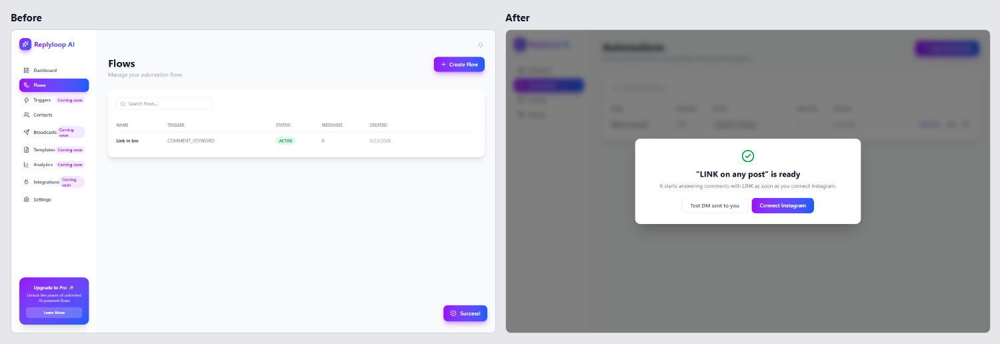
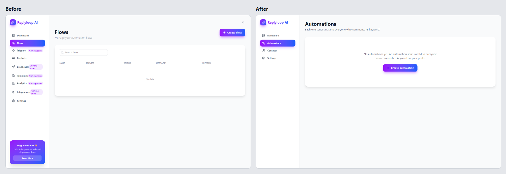

# Replyloop, before and after

Replyloop is a fictional app for Instagram creators: when someone comments a keyword on a post, it sends them a DM.

- `before/` is the app the way a code generator tends to write it: a sales page in front of the tool, a dashboard of invented numbers, a nine-field modal and dead buttons.
- `after/` is the same app, with the same purple gradients, cards and sidebar. The form asks for the keyword and the message, shows a preview of the DM, and lets you send a test to yourself before connecting Instagram.
- `review/` is the Phyll review of `before/`, rendered in [review/report.md](review/report.md).
- `screenshots/` holds the comparisons.

| | Before | After |
| --- | --- | --- |
| AI tell index from the scanner | 75 | 7 |
| Fields to create an automation | 9 | 2 |
| Clicks to a tested DM | never reached | 3 |
| Style traits | 10 | the same 10 |

[../README.md](../README.md) explains how to run both versions and regenerate the screenshots.
