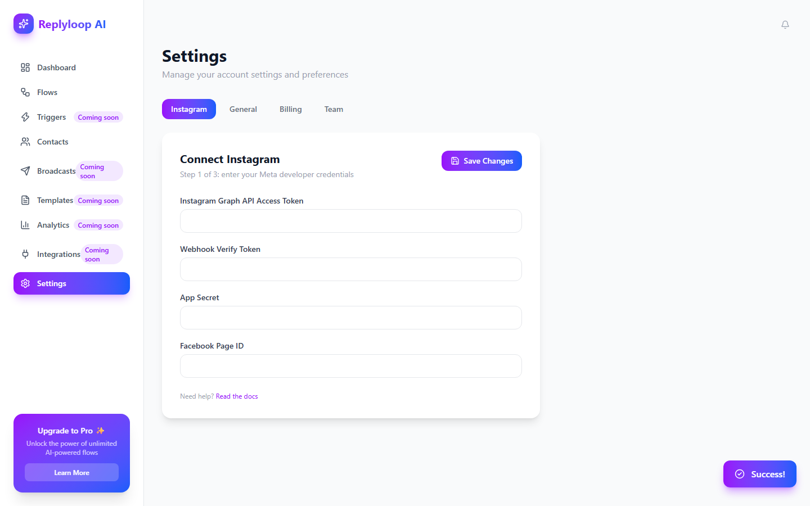
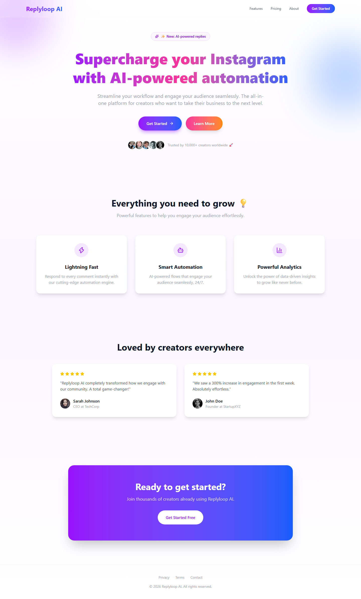
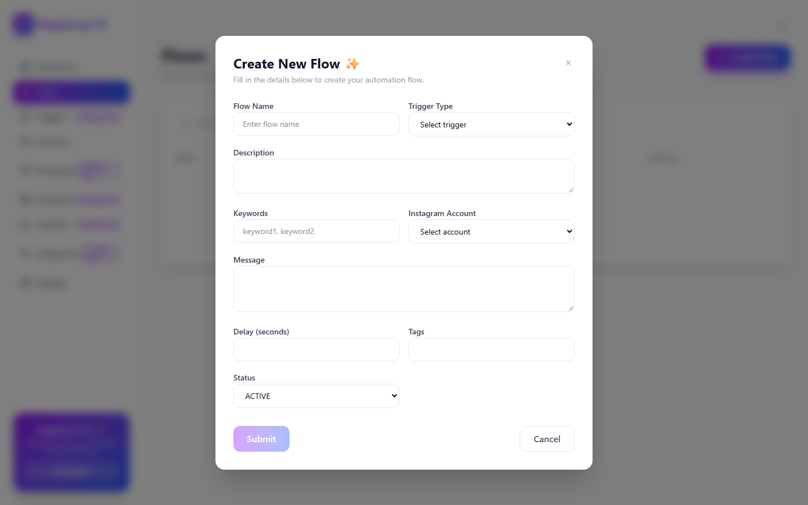
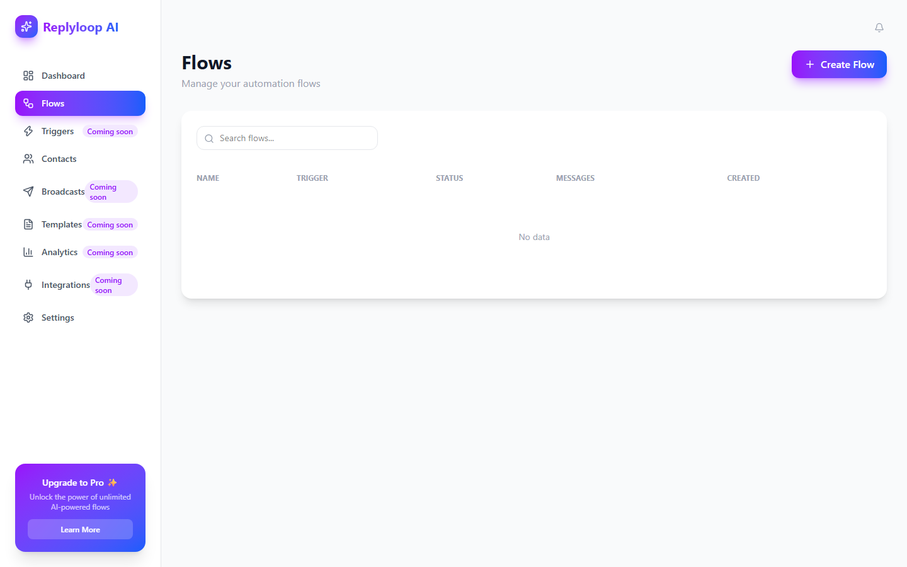
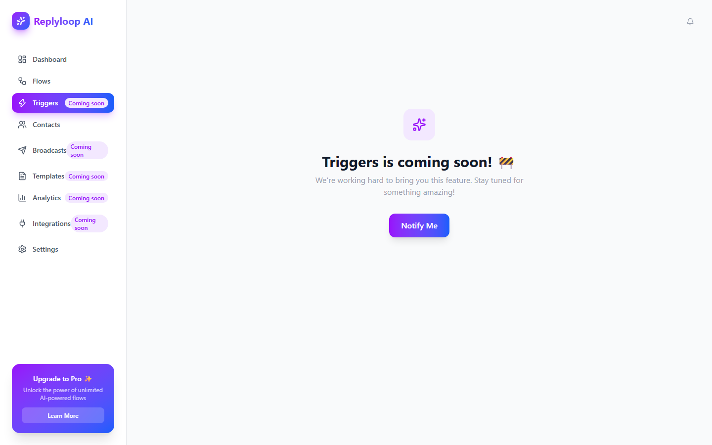
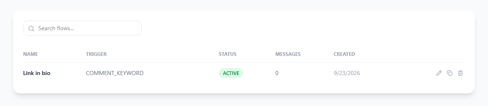
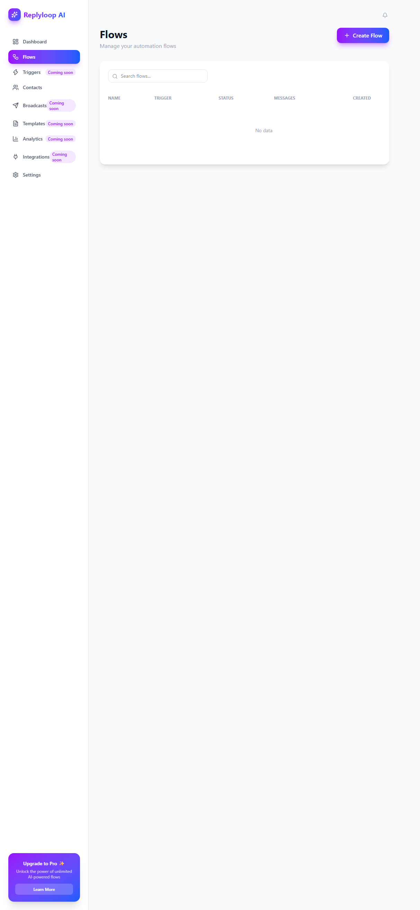
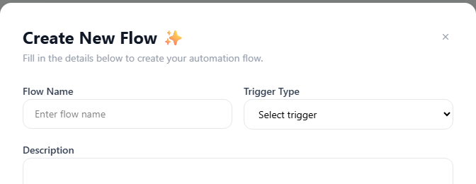
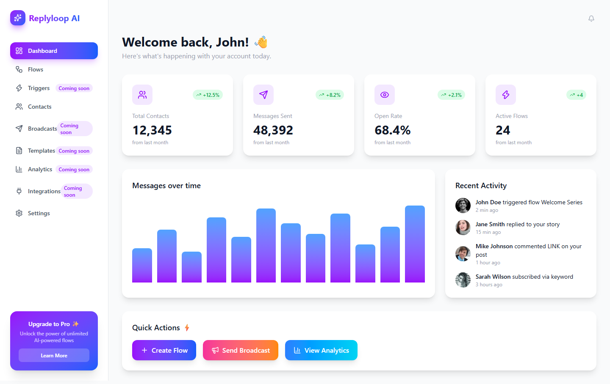

# Phyll review: Replyloop AI (before)

2026-09-23 · full review · http://localhost:5173

| AI tell index | Inputs asked / needed | Previous review | Findings |
| --- | --- | --- | --- |
| **79/100** | 9 / 2 | none | blocker: 2, major: 6, minor: 3, polish: 1 |

Lower is better. The index counts how many distinct AI tells get in the way of the person using the product, weighted by how much each one hurts.

Style notes: 10 tells about the generated look (style index 96/100). Phyll lists them and leaves the visual design as it is.

## What blocks people most

1. **UX-01: Going live needs developer credentials a creator does not have** (blocker, flow). The people this product is for have an Instagram account, not a Meta developer app. They stop at this screen, and nothing lets them see an automation work before it. Fix: Let people build and preview an automation first, and send a test to their own account. Ask to connect Instagram when they save, with a Sign in with Instagram button instead of token fields.
2. **UX-02: The app opens on a sales page, then on invented numbers** (blocker, purpose). A new user never sees what the product does or where to start. The fake numbers also make it hard to trust any real ones later. Fix: Open the app on Automations. For a new account, show one sentence on what an automation does and a button to create the first one. Show numbers only when they are real.
3. **UX-03: Nine fields in a modal before the first automation** (major, flow). A working automation needs a keyword and a message. The other fields slow people down, the trigger and status options are code words, and there is no preview of the DM they are writing. Fix: Move creation to its own page. Ask for the keyword and the message in one sentence, show a live preview of the DM, give the rest defaults under More options, and validate on save with specific messages.

## Five-second test

- What is this? Some AI tool for Instagram. The headline says supercharge and automation, not what it does.
- Who is it for? Creators, from the line about 10,000+ creators.
- What do I do now? Get Started or Learn More, without saying what either leads to.
- Result: failed. Nothing in the first view mentions comments, keywords or DMs.

## Journeys

| Job | Clicks | Screens | Dead ends | Reached the goal |
| --- | --- | --- | --- | --- |
| J1. Create an automation that sends a DM when someone comments a keyword | 9 | 5 | 3 | no |
| J2. See who received a DM and from which keyword | 3 | 1 | 1 | no |

J1: Stopped at Settings. A creator without a Meta developer account cannot go further, and nothing can be tested before that step.

J2: The list is sample data, so it cannot tell the creator who received a DM.

## What can be cut

What each job asks for, against what it needs to reach its goal. Every cut keeps the design as it is.

| Job | Inputs asked | Inputs needed | Clicks now | Clicks needed |
| --- | --- | --- | --- | --- |
| J1. Create an automation that sends a DM when someone comments a keyword | 9 | 2 | 9 | 3 |

J1. Create an automation that sends a DM when someone comments a keyword

- Flow Name: ask later. Name it after the keyword, such as LINK on any post. It can be renamed under More options.
- Trigger Type: use a default. Comment keyword is the only trigger that works today.
- Description: remove. The name and the message already say what the automation does.
- Instagram Account: infer it. Use the connected account, and ask only when there is more than one.
- Delay (seconds): use a default. Start with no delay.
- Tags: remove. Nothing in the app uses tags.
- Status: use a default. New automations start on, and the list can pause them.
- Keywords: keep. One keyword, with a hint that a single word works best.
- Message: keep. With a live preview of the DM next to it.

## All findings

### UX-01. Going live needs developer credentials a creator does not have

Blocker · flow · effort L · tells F05, C05



Evidence:

- S6 (screens/desktop-settings-saved.png): Connecting Instagram asks for a Graph API access token, a webhook verify token, an app secret and a Facebook page id.
- S4: The create form requires an Instagram account, offered only as the raw id page_1784140.

Why it matters: The people this product is for have an Instagram account, not a Meta developer app. They stop at this screen, and nothing lets them see an automation work before it. Principle: Progressive disclosure.

Fix: Let people build and preview an automation first, and send a test to their own account. Ask to connect Instagram when they save, with a Sign in with Instagram button instead of token fields.

Files: `examples/dm-automation/before/src/pages/Settings.jsx`, `examples/dm-automation/before/src/components/CreateFlowModal.jsx`

### UX-02. The app opens on a sales page, then on invented numbers

Blocker · purpose · effort M · tells P01, P02, P03, L07, C03



Evidence:

- S1 (screens/desktop-home.png): The root route is a landing page whose headline says 'Supercharge your Instagram with AI-powered automation' and never mentions comments or DMs.
- S2 (screens/desktop-dashboard.png): Get Started leads to a dashboard showing 12,345 contacts, 48,392 messages and +12.5% trends for an account with no automations.
- examples/dm-automation/before/src/data/mock.js:2: The dashboard numbers are hardcoded.

Why it matters: A new user never sees what the product does or where to start. The fake numbers also make it hard to trust any real ones later. Principle: Match between the system and the real world (Nielsen).

Fix: Open the app on Automations. For a new account, show one sentence on what an automation does and a button to create the first one. Show numbers only when they are real.

Files: `examples/dm-automation/before/src/App.jsx`, `examples/dm-automation/before/src/pages/Dashboard.jsx`

### UX-03. Nine fields in a modal before the first automation

Major · flow · effort M · tells F02, F03, A07, C05



Evidence:

- S4 (screens/desktop-flows-create.png): Create Flow opens a modal with nine fields: name, trigger type, description, keywords, account, message, delay, tags and status.
- S4: Submit stays greyed out until six of them are filled, including a delay in seconds, and nothing says which are missing.
- examples/dm-automation/before/src/components/CreateFlowModal.jsx:92: The button is disabled={!isValid} with no message.

Why it matters: A working automation needs a keyword and a message. The other fields slow people down, the trigger and status options are code words, and there is no preview of the DM they are writing. Principle: Progressive disclosure.

Fix: Move creation to its own page. Ask for the keyword and the message in one sentence, show a live preview of the DM, give the rest defaults under More options, and validate on save with specific messages.

```jsx
<label htmlFor="keyword">When someone comments</label> <input id="keyword" /> on any post, send them this DM: <textarea id="message" />
```

Files: `examples/dm-automation/before/src/components/CreateFlowModal.jsx`

### UX-04. The empty list says No data, with the Create button far away

Major · actions · effort S · tells A01, S01



Evidence:

- S3 (screens/desktop-flows.png): The empty table reads 'No data' in the middle of the page. Create Flow sits in the top-right corner, about 550 pixels from that text.
- examples/dm-automation/before/src/pages/Flows.jsx:60: The empty state is the words No data in light gray.

Why it matters: The empty list is the moment a new user needs to be told what a flow is and how to make one. The screen gives neither, and the only action is outside the content. Principle: Fitts's law.

Fix: Replace No data with a short explanation and put the create button inside the empty state. Keep a New automation button next to the list title once there are items.

Files: `examples/dm-automation/before/src/pages/Flows.jsx`

### UX-05. Success! appears even when nothing worked

Major · states · effort M · tells F04, S04, S03


Evidence:

- S6 (screens/desktop-settings-saved.png): Save Changes showed a Success! toast while the request to /api/instagram/connect returned 404.
- S5 (screens/desktop-flows-created.png): After creating a flow the toast says Success! and the row says ACTIVE, with no Instagram account connected and nothing pointing to the next step.
- examples/dm-automation/before/src/pages/Settings.jsx:19: Errors are caught and only logged to the console.

Why it matters: People believe their automation is working when it cannot send anything. They find out only when followers complain that no DM arrived. Principle: Visibility of system status (Nielsen).

Fix: Check the response and show a specific error when a request fails. After creating an automation, open its page and say whether it is live, what is missing, and offer a test.

```jsx
const response = await fetch(url, options);
if (!response.ok) throw new Error(`Instagram answered ${response.status}`);
```

Files: `examples/dm-automation/before/src/pages/Settings.jsx`, `examples/dm-automation/before/src/pages/Flows.jsx`

### UX-06. Half the navigation leads to Coming soon

Major · purpose · effort S · tells P04, P05, F01



Evidence:

- S3: The sidebar has nine items. Triggers, Broadcasts, Templates, Analytics and Integrations are marked Coming soon.
- S8 (screens/desktop-triggers.png): Each of those opens a page that says it is coming soon, with a Notify Me button that does nothing.
- S2: Quick Actions: Send Broadcast shows an alert saying Coming soon and View Analytics does nothing.

Why it matters: Every dead item costs a click and makes the product feel unfinished. The five tables at the top level also hide the one job people came to do. Principle: Hick's law.

Fix: Keep four items that match jobs: Automations, Activity, Contacts and Settings. Remove what is not built, and fold triggers and templates into the automation page.

Files: `examples/dm-automation/before/src/components/AppLayout.jsx`, `examples/dm-automation/before/src/App.jsx`

### UX-07. Row actions are invisible, unlabeled, and delete has no undo

Major · actions · effort S · tells A05, A03, A04, A08, F01



Evidence:

- S5 (screens/desktop-flows-row-hover.png): Edit, copy and delete appear only on hover, as 22 by 22 pixel icons without labels or accessible names.
- S5: Delete removed the flow at once and left 'No data', with no undo.
- examples/dm-automation/before/src/pages/Flows.jsx:74: Edit only logs to the console and copy has an empty handler.

Why it matters: On a phone the actions never appear. On a computer people have to guess what each icon does, and one slip deletes an automation for good. Principle: User control and freedom (Nielsen).

Fix: Show an Edit link on every row and put Pause and Delete in a labeled More menu. After delete, show 'Deleted. Undo' for a few seconds.

Files: `examples/dm-automation/before/src/pages/Flows.jsx`

### UX-08. The app does not fit on a phone

Major · states · effort M · tells S05



Evidence:

- S3 (screens/mobile-flows.png): At 390 pixels the page needs 1,213 pixels of width, so the browser zooms out until the text is too small to read.
- examples/dm-automation/before/src/components/AppLayout.jsx:73: The main area has ml-64 and min-w-[900px], and the sidebar is always fixed.

Why it matters: Creators check comments on their phone. On a phone, this app is unusable. Principle: WCAG 1.4.10 reflow.

Fix: Collapse the sidebar into a top bar below the md breakpoint, remove fixed widths, and stack grids into one column on small screens.

Files: `examples/dm-automation/before/src/components/AppLayout.jsx`, `examples/dm-automation/before/src/pages/Dashboard.jsx`

### UX-09. Gray text below the contrast minimum on every screen

Minor · look · effort S · tells L12

Evidence:

- S1: 14 of 33 text elements on the landing page are below 4.5 to 1, such as #99a1af on white at 2.6 to 1.
- S2: 21 of 54 text elements on the dashboard fail the same check.

Why it matters: Descriptions, dates and labels are hard to read, especially on a phone outdoors. Principle: WCAG 1.4.3 contrast.

Fix: Use gray-600 or darker for secondary text on white.

### UX-10. Keyboard focus is invisible

Minor · states · effort S · tells S06



Evidence:

- S4 (screens/desktop-flows-focus.png): With keyboard focus on the Flow Name field, the computed outline style is none and there is no box shadow.
- examples/dm-automation/before/src/index.css:8: button:focus sets outline to none, and inputs use outline-none.

Why it matters: People who use the keyboard cannot see where they are in the form. Principle: WCAG 2.4.7 focus visible.

Fix: Remove outline: none and add a focus-visible ring in the brand color.

```css
className="... focus-visible:ring-2 focus-visible:ring-offset-2"
```

Files: `examples/dm-automation/before/src/index.css`, `examples/dm-automation/before/src/components/CreateFlowModal.jsx`

### UX-11. Copy that could belong to any product, and made-up proof

Minor · copy · effort S · tells C01, C02, C03, C04, C06

Evidence:

- S1: 'Streamline your workflow and engage your audience seamlessly. The all-in-one platform...', 'Trusted by 10,000+ creators', and testimonials from 'Sarah Johnson, CEO at TechCorp'.
- S2: 'Welcome back, John!' and a Recent Activity list of John Doe and Jane Smith with stock avatars.

Why it matters: The words do not say what the product does, and invented proof damages trust once someone notices it. Principle: Don't make me think (Krug).

Fix: Say the job plainly: 'Send a DM to everyone who comments a keyword on your posts.' Remove the testimonials, the user counts and the placeholder people until there are real ones.

Files: `examples/dm-automation/before/src/pages/Landing.jsx`, `examples/dm-automation/before/src/pages/Dashboard.jsx`, `examples/dm-automation/before/src/data/mock.js`

### UX-12. The look is a stock generated template

Polish · look · effort M · tells L01, L02, L03, L04, L06, L08, L09, L10, L11



Evidence:

- S1: 7 gradient elements, 2 gradient headlines, 3 blurred layers and 8 large rounded shadowed boxes on the landing page.
- S2 (screens/desktop-dashboard.png): Every card scales on hover, every icon sits in a pale purple square, and emoji decorate the headings.

Why it matters: Nothing on screen reflects this product or its audience, and the decoration competes with the few things that matter. Principle: Aesthetic and minimalist design (Nielsen).

Fix: Pick one brand color for the main action, use solid surfaces and plain borders, left-align text, drop emoji and sparkle icons, and keep motion for feedback.

## Quick wins

- UX-04: The empty list says No data, with the Create button far away (effort S)
- UX-06: Half the navigation leads to Coming soon (effort S)
- UX-07: Row actions are invisible, unlabeled, and delete has no undo (effort S)
- UX-09: Gray text below the contrast minimum on every screen (effort S)
- UX-10: Keyboard focus is invisible (effort S)

## AI tells found

| Tell | Name | Evidence |
| --- | --- | --- |
| P01 | The first screen does not say what this is or what to do | S1; The five-second test failed. |
| P02 | A marketing page in front of the tool | 3 hits in the source |
| P03 | A dashboard of zeros or invented numbers for a new user | S2; 12,345 contacts and +12.5% trends on an account with no automations. |
| P04 | Navigation that mirrors the database | S3; Nine top-level items that mirror the data model. |
| P05 | Features that do not exist yet | 6 hits in the source |
| P06 | More features than the job needs | S2; Triggers, Broadcasts, Templates, Analytics and Integrations sit in the menu, all marked Coming soon. |
| F01 | Dead buttons and fake links | 16 hits in the source |
| F02 | Everything asked up front | 1 hit in the source |
| F03 | A modal for everything | 3 hits in the source |
| F04 | A dead end after success | S5 |
| F05 | Sign-up or setup before the first result | S6 |
| F06 | Confirmation for safe actions | 4 hits in the source |
| F07 | A wizard for a one-screen task | 1 hit in the source |
| F09 | Options the system could decide | S4; Trigger type, account, delay and status each have one sensible answer, and the form still asks for all four. |
| A01 | The main action far from what it acts on | probe/desktop-flows.json; Create Flow sits at x 1257 to 1408, y 80. The empty table spans x 312 to 1384, y 302 to 450. |
| A02 | Several primary buttons competing | probe/desktop-dashboard.json, probe/desktop-home.json; Three gradient buttons compete in Quick Actions, and two on the landing page. |
| A03 | Icon-only buttons with no name | 6 hits in the source |
| A04 | Destructive actions that look safe | S5; Delete removes the row at once, with no undo. |
| A05 | Actions that only appear on hover | 1 hit in the source |
| A06 | The same action in a different place on each screen | S4, S6; Submit sits bottom left in the modal; Save Changes sits top right in Settings. |
| A07 | Disabled buttons that do not say why | 1 hit in the source |
| A08 | Targets too small to tap | S5, S7; Row and card icon buttons measure 22 by 22 pixels. |
| L07 | KPI cards with invented trends | 4 hits in the source |
| L12 | Washed-out text | 32 hits in the source |
| C01 | Generic value-proposition phrases | 13 hits in the source |
| C02 | Buttons that do not say what happens | 5 hits in the source |
| C03 | Invented social proof and numbers | 6 hits in the source |
| C04 | Placeholder people and data left in | 15 hits in the source |
| C05 | Code words on screen | 3 hits in the source |
| C06 | Stock greetings and filler | 2 hits in the source |
| C07 | Error messages that do not help | 1 hit in the source |
| S01 | Empty states that only say no data | 1 hit in the source |
| S03 | Errors that only reach the console | 1 hit in the source |
| S04 | Success that leaves no trace | 2 hits in the source |
| S05 | Breaks on a phone | 5 hits in the source |
| S06 | Focus outline removed | 4 hits in the source |

Absent: 5. Not verified: 2.

## Style notes

These tells are about the generated look. Phyll lists them so you know, and fix mode leaves them alone unless you ask for a visual change.

| Tell | Name | Evidence |
| --- | --- | --- |
| L01 | Purple-to-blue gradient as the brand | 18 hits in the source |
| L02 | Gradient text | 3 hits in the source |
| L03 | Glass, blur and glow | 10 hits in the source |
| L04 | Everything is a card | 22 hits in the source |
| L05 | The three-card feature grid | 2 hits in the source |
| L06 | An icon in a tinted square for every item | 2 hits in the source |
| L08 | Emoji as icons | 9 hits in the source |
| L09 | Sparkles and AI-powered badges | 10 hits in the source |
| L10 | Everything centered | 14 hits in the source |
| L11 | Motion on everything | 18 hits in the source |

## Assumptions

- The product's purpose was inferred from its name and the landing copy, since no screen states it.
- The app runs without a backend, so every API call fails. The review judges what the interface tells the person when that happens.
- The creator has an Instagram business account but no Meta developer account.

---

Generated by Phyll 0.2.0 on 2026-09-23. The index formula is in references/report-format.md in the Phyll skill.
