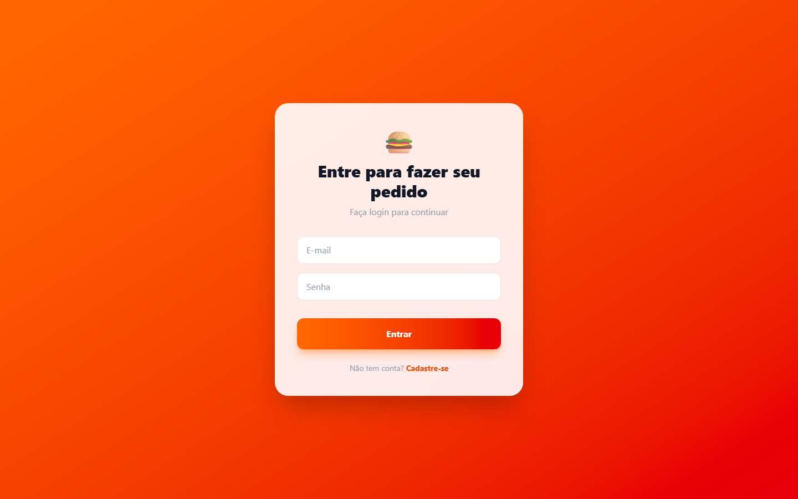
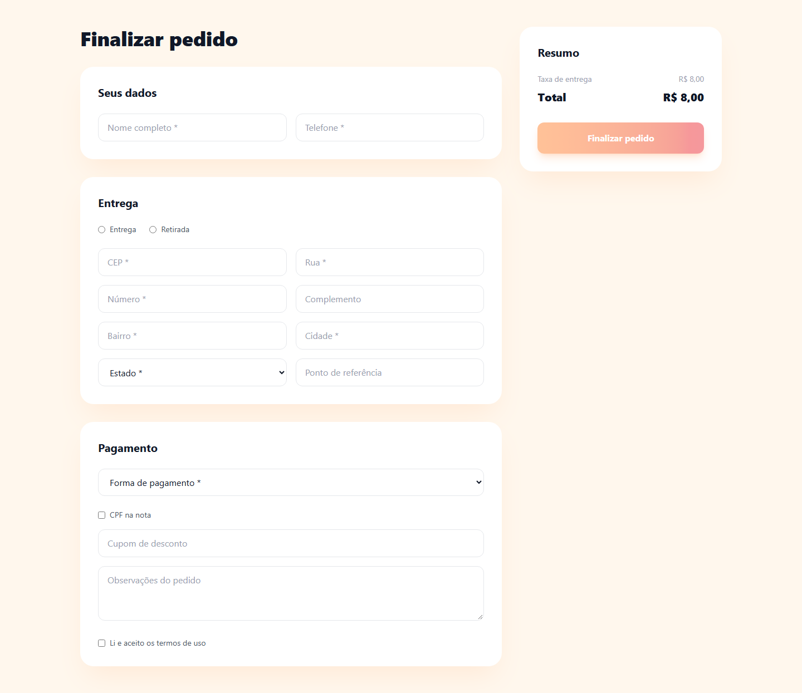
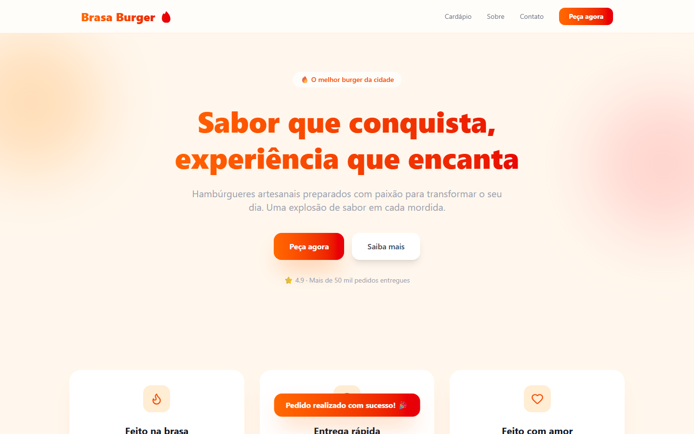
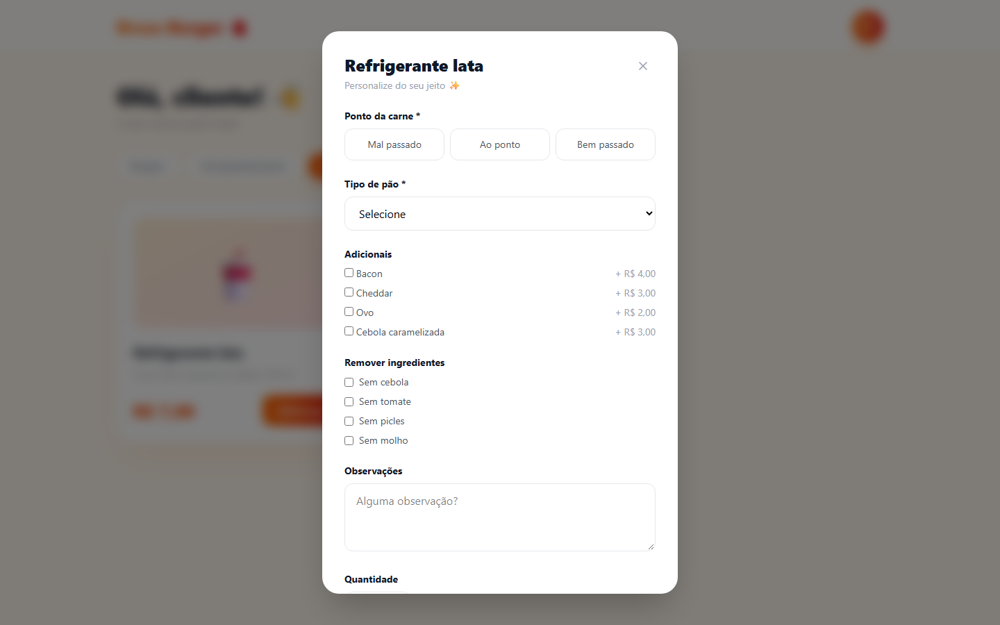
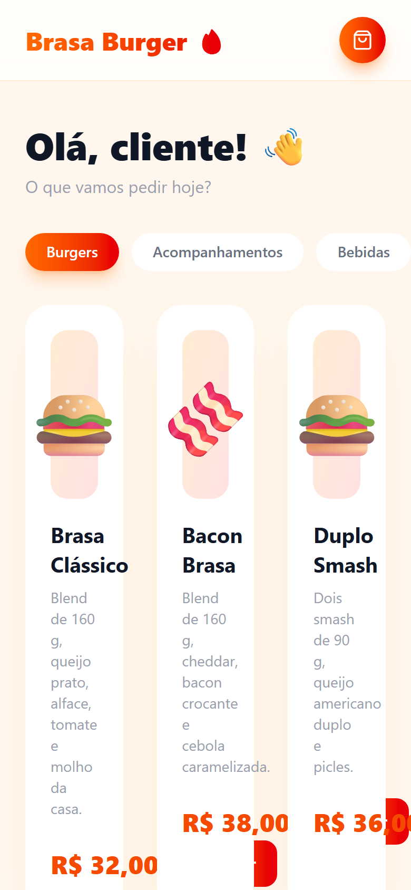
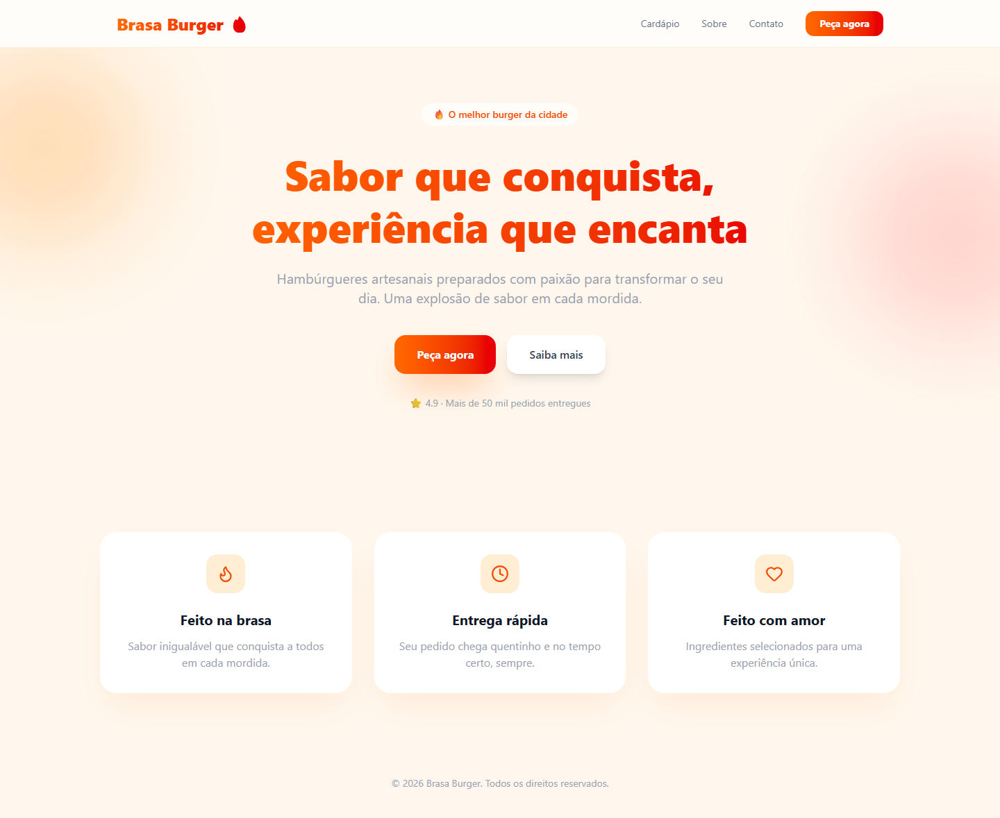

# Revisão do Phyll: Brasa Burger (antes)

2026-09-23 · revisão completa · http://localhost:5179

| Índice de cara de IA | Campos pedidos / necessários | Revisão anterior | Achados |
| --- | --- | --- | --- |
| **43/100** | 33 / 4 | nenhuma | bloqueador: 3, grave: 4, menor: 2, acabamento: 0 |

Quanto menor, melhor. O índice conta quantos sinais de IA diferentes atrapalham quem usa o produto, com peso maior para os que atrapalham mais.

Notas de estilo: 8 sinais da aparência gerada (índice de estilo 74/100). O Phyll aponta e deixa o design visual como está.

## O que mais trava quem usa

1. **UX-01: Login e cadastro antes de ver o cardápio** (bloqueador, fluxo). Quem chega com fome pelo Instagram quer ver o cardápio e os preços antes de qualquer coisa. Um cadastro com CPF para pedir um lanche faz a pessoa voltar ao aplicativo de entrega que já usa. Correção: Abra o cardápio direto. Peça nome e WhatsApp só no fim, no próprio pedido, e guarde esses dados no aparelho para a próxima vez.
2. **UX-02: O checkout pede o cartão e mais 16 campos** (bloqueador, fluxo). Pedir número do cartão e CVV num formulário que não processa pagamento é arriscado e tira a confiança no resto do site. Para entregar um lanche, a loja precisa do endereço, de um nome, de um telefone e de saber como a pessoa vai pagar. Correção: Pagamento na entrega com três botões, Pix, cartão ou dinheiro, e troco opcional. Endereço num campo só, complemento opcional, nome e WhatsApp. CPF na nota e observação ficam num bloco que abre quando precisa. Tire cupom e aceite de termos.
3. **UX-03: Depois de pedir, nada confirma o pedido** (bloqueador, estados). Sem número e sem previsão, a pessoa não sabe se o pedido chegou à loja. Ela liga, espera sem saber ou pede de novo em outro lugar. Correção: Troque a pergunta e o aviso por uma tela de pedido recebido, com número, itens, total, previsão de entrega e forma de pagamento. Ponha nela Falar com a loja no WhatsApp e Pedir de novo.

## Teste dos cinco segundos

- O que é isto? Uma hamburgueria, pelo nome e pelo emoji. O título fala em sabor que conquista, não em pedir pelo site.
- Para quem é? Quem gosta de hambúrguer artesanal.
- O que eu faço agora? Peça agora, que leva a um login. Saiba mais e os links do menu não levam a lugar nenhum.
- Resultado: passou. Por pouco. Dá para entender que é uma hamburgueria e que dá para pedir, mas não onde ela entrega, quanto tempo leva nem quanto custa a entrega.

## Jornadas

| Tarefa | Cliques | Telas | Becos sem saída | Chegou ao objetivo |
| --- | --- | --- | --- | --- |
| J1. Pedir um hambúrguer para entrega | 15 | 4 | 1 | não |
| J2. Saber quando o pedido chega | 1 | 1 | 1 | não |

J1: O pedido parece enviado, mas nenhuma tela confirma o que foi pedido nem quando chega.

J2: A pessoa não tem como saber se o pedido chegou à loja nem como falar com ela.

## O que dá para cortar

O que cada tarefa pede, comparado com o que ela precisa para chegar ao objetivo. Todo corte mantém o design como está.

| Tarefa | Campos pedidos | Campos necessários | Cliques hoje | Cliques necessários |
| --- | --- | --- | --- | --- |
| J1. Pedir um hambúrguer para entrega | 33 | 4 | 15 | 5 |

J1. Pedir um hambúrguer para entrega

- Cadastro inteiro: nome completo, telefone, CPF, data de nascimento, e-mail, senha e confirmação: remover. Pedir comida não precisa de conta. Nome e WhatsApp vão no próprio pedido e ficam salvos no aparelho.
- Ponto da carne e tipo de pão: usar um padrão. O lanche já vem ao ponto, no brioche. Bebidas, acompanhamentos e sobremesas não têm opção nenhuma.
- Adicionais, ingredientes para tirar e observação do lanche: pedir depois. Ficam em Personalizar, que só abre quando a pessoa quer.
- Quantidade no modal: juntar com outro campo. Vira os botões de mais e menos na sacola.
- Entrega ou retirada: usar um padrão. Começa em Entrega, com a taxa ao lado. Retirada fica a um toque.
- CEP, rua, número, bairro, cidade e estado: juntar com outro campo. Viram um campo de endereço: rua, número e bairro. Cidade e estado são sempre os mesmos numa entrega local.
- Complemento e ponto de referência: juntar com outro campo. Viram um campo opcional.
- Número, nome, validade e CVV do cartão: remover. O pagamento é na entrega. Um site que não processa cartão não deve pedir esses dados.
- CPF na nota e observações do pedido: pedir depois. Ficam num bloco opcional, fechado.
- Cupom de desconto: remover. Não existe cupom ativo.
- Aceite dos termos de uso: remover. Sem conta, não há termo para aceitar.
- Nome e telefone: manter. O telefone vira o WhatsApp, por onde a loja avisa quando o pedido sai.
- Forma de pagamento: manter. Vira três botões, Pix, cartão ou dinheiro, com troco opcional no dinheiro.

## Todos os achados

### UX-01. Login e cadastro antes de ver o cardápio

Bloqueador · fluxo · esforço M · sinais F05, F11, F12, A09

Evidência:

- S2 (screens/desktop-entrar.png): Peça agora leva a Entre para fazer seu pedido. O cardápio só abre depois de entrar.
- S2: O cadastro pede CPF, data de nascimento e a senha duas vezes. A data aparece só como dd/mm/aaaa, porque um campo de data não mostra o placeholder.

Por que atrapalha: Quem chega com fome pelo Instagram quer ver o cardápio e os preços antes de qualquer coisa. Um cadastro com CPF para pedir um lanche faz a pessoa voltar ao aplicativo de entrega que já usa. Princípio: Valor antes do cadastro.

Correção: Abra o cardápio direto. Peça nome e WhatsApp só no fim, no próprio pedido, e guarde esses dados no aparelho para a próxima vez.

Arquivos: `examples/menu/before/src/pages/Login.jsx`, `examples/menu/before/src/pages/Landing.jsx`, `examples/menu/before/src/pages/Menu.jsx`

### UX-02. O checkout pede o cartão e mais 16 campos

Bloqueador · fluxo · esforço M · sinais F02, F11, F12

Evidência:

- S4 (screens/desktop-checkout.png): A página tem 17 campos soltos e mais 4 de cartão, com número, nome, validade e CVV, sem nenhum processamento de pagamento.
- S4: O endereço em sete campos é obrigatório mesmo com Retirada marcada. Nome e telefone são pedidos de novo depois do cadastro.

Por que atrapalha: Pedir número do cartão e CVV num formulário que não processa pagamento é arriscado e tira a confiança no resto do site. Para entregar um lanche, a loja precisa do endereço, de um nome, de um telefone e de saber como a pessoa vai pagar. Princípio: Pergunte só o que a tarefa usa.

Correção: Pagamento na entrega com três botões, Pix, cartão ou dinheiro, e troco opcional. Endereço num campo só, complemento opcional, nome e WhatsApp. CPF na nota e observação ficam num bloco que abre quando precisa. Tire cupom e aceite de termos.

Arquivos: `examples/menu/before/src/pages/Checkout.jsx`

### UX-03. Depois de pedir, nada confirma o pedido

Bloqueador · estados · esforço S · sinais F04, S04, F06

Evidência:

- S1 (screens/desktop-pedido-feito.png): Depois de Finalizar pedido e da pergunta Deseja realmente finalizar o pedido?, o site volta para a página inicial com o aviso Pedido realizado com sucesso!. Não há número, total nem previsão.

Por que atrapalha: Sem número e sem previsão, a pessoa não sabe se o pedido chegou à loja. Ela liga, espera sem saber ou pede de novo em outro lugar. Princípio: Visibilidade do estado do sistema.

Correção: Troque a pergunta e o aviso por uma tela de pedido recebido, com número, itens, total, previsão de entrega e forma de pagamento. Ponha nela Falar com a loja no WhatsApp e Pedir de novo.

Arquivos: `examples/menu/before/src/pages/Checkout.jsx`

### UX-04. O mesmo modal de opções para tudo, até para refrigerante

Grave · fluxo · esforço S · sinais F03, F09, A07

Evidência:

- S3 (screens/desktop-adicionar-bebida.png): Adicionar uma lata de refrigerante abre o modal com ponto da carne e tipo de pão, os dois obrigatórios.
- S3 (screens/desktop-adicionar-burger.png): No lanche, nenhum ponto nem pão vem escolhido, e Adicionar ao carrinho fica apagado sem dizer por quê.

Por que atrapalha: Cada item vira um formulário. A maioria das pessoas quer o lanche como está no cardápio, e uma bebida não tem opção nenhuma. Princípio: Padrões que já funcionam.

Correção: Adicionar põe o item na sacola na hora, com o lanche ao ponto e no brioche. Deixe Personalizar como um link embaixo do lanche, com essas opções já marcadas. Bebidas, acompanhamentos e sobremesas não abrem nada.

Arquivos: `examples/menu/before/src/pages/Menu.jsx`

### UX-05. Pelo teclado, não dá para escolher o ponto da carne

Grave · ações · esforço S · sinais S06

Evidência:

- S3: Os botões de ponto são rádios escondidos com display none. Com Tab, o foco pula do fundo da página para o pão e nunca chega ao ponto. Sem ponto, o lanche não entra no carrinho.
- S3: Ao abrir o modal, o foco continua nos botões Adicionar atrás dele.

Por que atrapalha: Quem usa teclado ou leitor de tela não consegue pedir nenhum lanche. Princípio: Tudo que se faz com o mouse se faz com o teclado (WCAG 2.1.1).

Correção: Esconda o rádio só visualmente, com sr-only, e mostre o foco no próprio botão. Leve o foco para dentro do modal ao abrir. Com o padrão já marcado, ninguém fica preso.

Arquivos: `examples/menu/before/src/pages/Menu.jsx`

### UX-06. O cardápio não cabe no celular

Grave · aparência · esforço S · sinais S05

Evidência:

- S3 (screens/mobile-cardapio.png): No celular, os cards ficam em três colunas estreitas. As descrições quebram uma palavra por linha e os preços saem do card.

Por que atrapalha: Quase todo pedido de comida acontece no celular. Nessa largura não dá para ler o cardápio. Princípio: Funcione na tela que a pessoa usa.

Correção: Uma coluna no celular, duas no tablet e três no computador. Mostre a sacola como uma barra fixa embaixo, com o total e Fazer pedido.

Arquivos: `examples/menu/before/src/pages/Menu.jsx`

### UX-07. Botões brancos em laranja claro e texto cinza apagado

Grave · aparência · esforço S · sinais L12

Evidência:

- S1: O texto branco dos botões em orange-500 dá 2,89:1, abaixo de 4,5:1. 11 dos 18 textos medidos na página inicial ficam abaixo do mínimo.
- S4: A taxa de entrega e o valor dela, em gray-400, ficam em 2,6:1.

Por que atrapalha: O botão mais importante do site é o mais difícil de ler, ainda mais com o celular no sol. Princípio: Contraste mínimo de 4,5:1 (WCAG 1.4.3).

Correção: Comece o degradê dos botões em orange-700, que dá 5,2:1 com branco, e troque gray-400 por gray-600. O laranja da marca continua.

Arquivos: `examples/menu/before/src/pages/Landing.jsx`, `examples/menu/before/src/pages/Menu.jsx`, `examples/menu/before/src/pages/Checkout.jsx`, `examples/menu/before/src/App.jsx`

### UX-08. O carrinho mostra códigos, e o botão dele não tem nome

Menor · texto · esforço S · sinais C05, A03

Evidência:

- S3: No carrinho, o lanche aparece como Ponto: AO_PONTO · Pão: Brioche.
- S3: O botão do carrinho no topo só tem o ícone de sacola, sem nome para leitor de tela e sem o total.

Por que atrapalha: Ninguém escreve AO_PONTO. E um ícone sem total obriga a abrir o carrinho para saber quanto já deu. Princípio: Fale a língua de quem usa.

Correção: Escreva Ao ponto, no brioche. Troque o ícone por um botão com nome, número de itens e total, ou deixe a sacola sempre à vista ao lado do cardápio.

Arquivos: `examples/menu/before/src/App.jsx`, `examples/menu/before/src/pages/Menu.jsx`

### UX-09. A página inicial não diz como pedir nem quanto tempo leva

Menor · propósito · esforço S · sinais C01, C02, C03, F01

Evidência:

- S1 (screens/desktop-home.png): O título é Sabor que conquista, experiência que encanta. A nota 4.9 e os 50 mil pedidos não têm fonte, e Saiba mais, Cardápio, Sobre e Contato apontam para #.

Por que atrapalha: Quem chega quer saber se a loja entrega onde está, quanto tempo leva e quanto custa a entrega. Princípio: Diga o que é, para quem e o que fazer.

Correção: Diga o tempo de entrega no título e ponha endereço, horário e área de entrega logo abaixo. Faça o botão principal abrir o cardápio e o rodapé mostrar o WhatsApp da loja.

Arquivos: `examples/menu/before/src/pages/Landing.jsx`

## Ganhos rápidos

- UX-04: O mesmo modal de opções para tudo, até para refrigerante (esforço S)
- UX-05: Pelo teclado, não dá para escolher o ponto da carne (esforço S)
- UX-06: O cardápio não cabe no celular (esforço S)
- UX-07: Botões brancos em laranja claro e texto cinza apagado (esforço S)
- UX-08: O carrinho mostra códigos, e o botão dele não tem nome (esforço S)

## Sinais de IA encontrados

| Sinal | Nome | Evidência |
| --- | --- | --- |
| F01 | Dead buttons and fake links | 4 ocorrências no código |
| F02 | Everything asked up front | 2 ocorrências no código |
| F03 | A modal for everything | 2 ocorrências no código |
| F04 | A dead end after success | S1; Depois de finalizar, a página inicial não mostra o pedido nem o que fazer. |
| F05 | Sign-up or setup before the first result | 1 ocorrência no código |
| F06 | Confirmation for safe actions | 1 ocorrência no código |
| F08 | Losing your place | S3; Recarregar o cardápio volta para o login com o carrinho vazio. |
| F09 | Options the system could decide | S3; Ponto e pão sem padrão, pedidos até para bebida. |
| F11 | Personal data the job does not use | 3 ocorrências no código |
| F12 | Asking for the same thing twice | 1 ocorrência no código |
| A03 | Icon-only buttons with no name | 2 ocorrências no código |
| A07 | Disabled buttons that do not say why | 3 ocorrências no código |
| A08 | Targets too small to tap | S1, S2; Os links do menu e o Cadastre-se têm menos de 24 px de altura. |
| A09 | Fields named only by their placeholder | 24 ocorrências no código |
| L12 | Washed-out text | 27 ocorrências no código |
| C01 | Generic value-proposition phrases | 1 ocorrência no código |
| C02 | Buttons that do not say what happens | 1 ocorrência no código |
| C03 | Invented social proof and numbers | 2 ocorrências no código |
| C05 | Code words on screen | S3; O carrinho mostra Ponto: AO_PONTO. |
| C06 | Stock greetings and filler | 1 ocorrência no código |
| S04 | Success that leaves no trace | 1 ocorrência no código |
| S05 | Breaks on a phone | 1 ocorrência no código |
| S06 | Focus outline removed | 5 ocorrências no código |

Ausentes: 19. Não verificados: 1.

## Notas de estilo

Estes sinais são da aparência gerada. O Phyll lista para você saber, e o modo de correção não mexe neles a não ser que você peça uma mudança visual.

| Sinal | Nome | Evidência |
| --- | --- | --- |
| L02 | Gradient text | 3 ocorrências no código |
| L03 | Glass, blur and glow | 8 ocorrências no código |
| L04 | Everything is a card | 15 ocorrências no código |
| L05 | The three-card feature grid | 4 ocorrências no código |
| L06 | An icon in a tinted square for every item | 4 ocorrências no código |
| L08 | Emoji as icons | 19 ocorrências no código |
| L10 | Everything centered | 9 ocorrências no código |
| L11 | Motion on everything | 11 ocorrências no código |

## Suposições

- O app roda sem servidor. O login aceita qualquer coisa, e o pedido não é enviado a lugar nenhum.
- O site não processa pagamento, embora peça os dados do cartão. Por isso a revisão trata o pagamento como feito na entrega.
- O público pede pelo celular, a partir de links do Instagram.

---

Gerado pelo Phyll 0.2.0 em 2026-09-23. A fórmula do índice está em references/report-format.md, na skill do Phyll.
