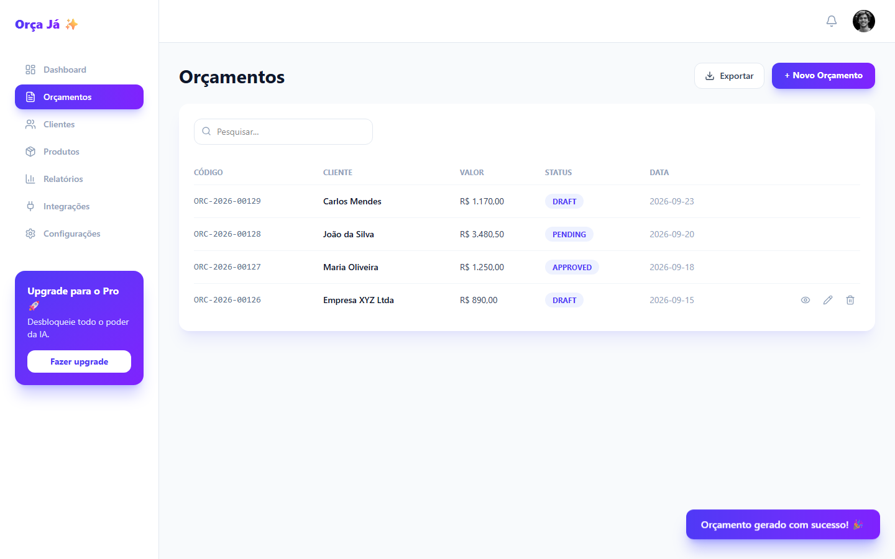
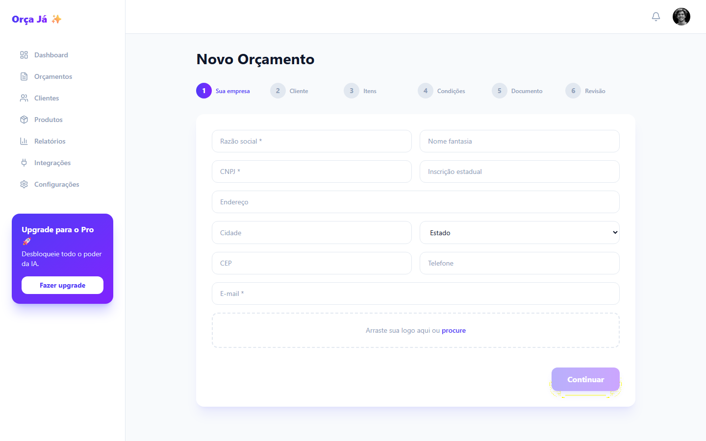
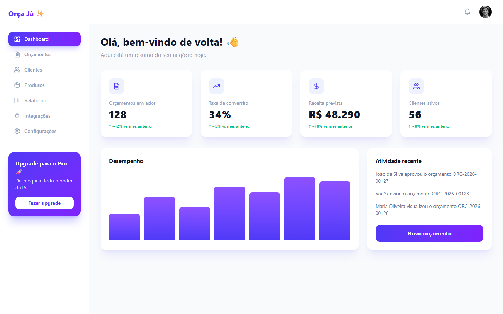
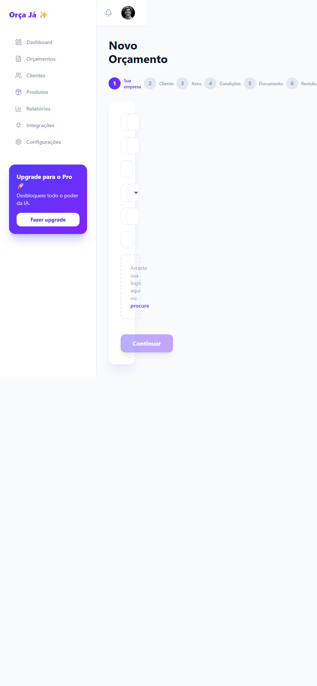
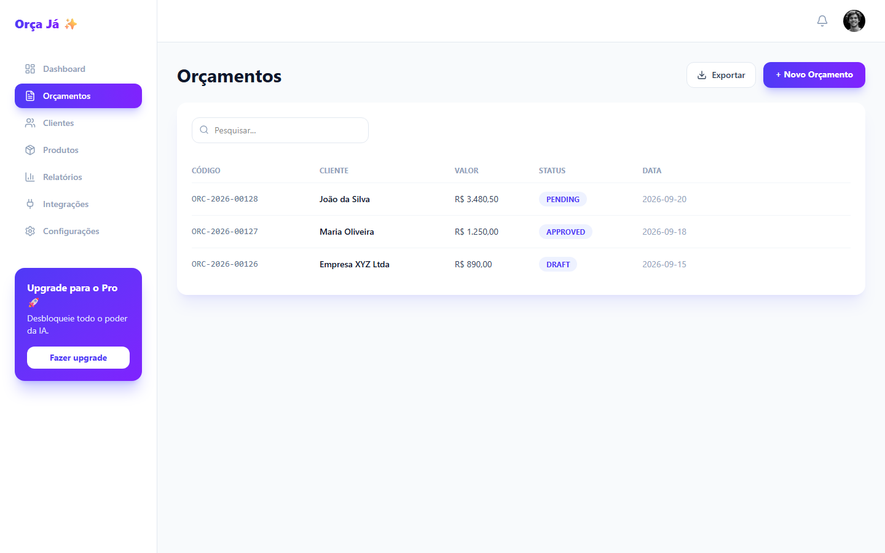
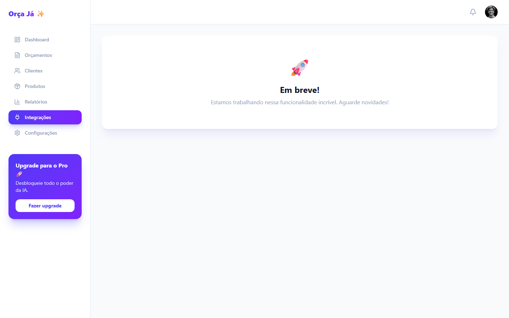

# Revisão do Phyll: Orça Já (antes)

2026-09-23 · revisão completa · http://localhost:5177

| Índice de cara de IA | Campos pedidos / necessários | Revisão anterior | Achados |
| --- | --- | --- | --- |
| **73/100** | 41 / 4 | nenhuma | bloqueador: 2, grave: 5, menor: 3, acabamento: 0 |

Quanto menor, melhor. O índice conta quantos sinais de IA diferentes atrapalham quem usa o produto, com peso maior para os que atrapalham mais.

Notas de estilo: 10 sinais da aparência gerada (índice de estilo 99/100). O Phyll aponta e deixa o design visual como está.

## O que mais trava quem usa

1. **UX-01: O orçamento fica pronto, mas não dá para enviar** (bloqueador, fluxo). Mandar o orçamento para o cliente é o motivo de usar o produto. Depois de seis etapas, a pessoa ainda precisa copiar os números à mão para o WhatsApp. Correção: Ponha Enviar pelo WhatsApp e Baixar PDF na mesma tela em que o orçamento é feito. Depois de enviar, mostre o orçamento com a situação e o próximo passo.
2. **UX-02: Seis etapas e 39 campos para um orçamento de dois itens** (bloqueador, fluxo). Quem faz orçamento quer responder rápido, muitas vezes com o cliente esperando no WhatsApp. Os dados da própria empresa, repetidos a cada orçamento, e os dados fiscais do cliente não mudam o preço. Correção: Uma página com seu nome ou empresa, que fica salvo, o cliente e os itens com descrição, quantidade e valor. Mostre o documento se montando ao lado. Validade, pagamento e observações ficam num bloco que abre quando precisa, com 7 dias de validade já preenchidos.
3. **UX-03: Um login antes de experimentar, que aceita campos vazios** (grave, fluxo). Quem chega pela primeira vez não tem conta e não consegue criar uma. A tela de login só atrasa, porque não confere nada. Correção: Leve Comece grátis direto ao novo orçamento. Salve os orçamentos no aparelho e ofereça conta só para quem quiser usar em outro lugar.

## Teste dos cinco segundos

- O que é isto? Alguma ferramenta de orçamento com inteligência artificial. O título fala em revolucionar, não no que ela faz.
- Para quem é? Empresas, pelos 10.000 clientes citados.
- O que eu faço agora? Comece grátis, que leva a um login. Ver demonstração não abre nada.
- Resultado: não passou. Nada na primeira tela diz como o orçamento chega ao cliente nem quanto tempo leva.

## Jornadas

| Tarefa | Cliques | Telas | Becos sem saída | Chegou ao objetivo |
| --- | --- | --- | --- | --- |
| J1. Fazer um orçamento e mandar para o cliente | 10 | 5 | 1 | não |
| J2. Saber quais orçamentos o cliente aprovou | 2 | 2 | 1 | não |

J1: O orçamento fica pronto, mas não sai do app. A pessoa copia os números à mão para o WhatsApp.

J2: A lista existe, mas mistura exemplos com orçamentos reais e não deixa registrar a resposta do cliente.

## O que dá para cortar

O que cada tarefa pede, comparado com o que ela precisa para chegar ao objetivo. Todo corte mantém o design como está.

| Tarefa | Campos pedidos | Campos necessários | Cliques hoje | Cliques necessários |
| --- | --- | --- | --- | --- |
| J1. Fazer um orçamento e mandar para o cliente | 41 | 4 | 10 | 2 |

J1. Fazer um orçamento e mandar para o cliente

- E-mail e senha do login: remover. O primeiro orçamento não precisa de conta. Os orçamentos ficam salvos no aparelho, e a conta vem para quem quiser usar em outro lugar.
- Razão social, nome fantasia, CNPJ e inscrição estadual: juntar com outro campo. Viram um campo só, Seu nome ou empresa, que fica salvo para os próximos orçamentos.
- Endereço, cidade, estado, CEP, telefone, e-mail e logo da empresa: pedir depois. Entram depois, para quem quiser um cabeçalho completo. Pelo WhatsApp, o orçamento já sai do número da pessoa.
- Tipo de pessoa e CPF ou CNPJ do cliente: remover. Orçamento não é nota fiscal.
- E-mail, telefone, CEP, endereço, cidade e estado do cliente: remover. O envio é pelo WhatsApp, e o cliente é escolhido nos contatos.
- Código, unidade e desconto de cada item: remover. Descrição, quantidade e valor bastam para o cliente entender o preço.
- Quantidade: usar um padrão. Começa em 1.
- Validade da proposta: usar um padrão. Começa em 7 dias e muda num bloco que abre quando precisa.
- Prazo de entrega, forma e condição de pagamento e observações: pedir depois. Ficam no mesmo bloco opcional, num campo de pagamento e outro de observações.
- Desconto geral e frete: remover. Quando existirem, entram como itens.
- Modelo, cor, moeda, idioma, impostos e numeração: usar um padrão. Um modelo só, em reais e em português, com numeração automática.
- Nome do cliente e descrição e valor de cada item: manter. É o que o cliente precisa ler.

## Todos os achados

### UX-01. O orçamento fica pronto, mas não dá para enviar

Bloqueador · fluxo · esforço M · sinais F04, F01, P05, A05

Evidência:

- S5 (screens/desktop-orcamento-gerado.png): Depois de Gerar orçamento, a lista mostra o orçamento como DRAFT. Não há botão de enviar, baixar ou copiar.
- S5: Os ícones de ver, editar e excluir só aparecem com o mouse sobre a linha, e ver e editar não fazem nada. Exportar abre um alerta Em breve!.

Por que atrapalha: Mandar o orçamento para o cliente é o motivo de usar o produto. Depois de seis etapas, a pessoa ainda precisa copiar os números à mão para o WhatsApp. Princípio: Termine a tarefa, não o formulário.

Correção: Ponha Enviar pelo WhatsApp e Baixar PDF na mesma tela em que o orçamento é feito. Depois de enviar, mostre o orçamento com a situação e o próximo passo.

Arquivos: `examples/quote/before/src/pages/Quotes.jsx`, `examples/quote/before/src/pages/NewQuote.jsx`

### UX-02. Seis etapas e 39 campos para um orçamento de dois itens

Bloqueador · fluxo · esforço M · sinais F02, F07, F09, F11

Evidência:

- S4 (screens/desktop-app-orcamentos-novo.png): A etapa 1 de 6 pede razão social, nome fantasia, CNPJ, inscrição estadual, endereço completo, telefone, e-mail e logo da própria empresa, em todo orçamento.
- S4 (screens/desktop-novo-etapa-itens.png): Cada item pede código, unidade e desconto além de descrição, quantidade e valor. O total não aparece em nenhuma etapa antes da revisão.
- S4 (screens/desktop-novo-etapa-documento.png): A etapa 5 pede modelo, cor, moeda, idioma, impostos e numeração, sem mostrar o documento.

Por que atrapalha: Quem faz orçamento quer responder rápido, muitas vezes com o cliente esperando no WhatsApp. Os dados da própria empresa, repetidos a cada orçamento, e os dados fiscais do cliente não mudam o preço. Princípio: Pergunte só o que a tarefa usa.

Correção: Uma página com seu nome ou empresa, que fica salvo, o cliente e os itens com descrição, quantidade e valor. Mostre o documento se montando ao lado. Validade, pagamento e observações ficam num bloco que abre quando precisa, com 7 dias de validade já preenchidos.

Arquivos: `examples/quote/before/src/pages/NewQuote.jsx`

### UX-03. Um login antes de experimentar, que aceita campos vazios

Grave · fluxo · esforço S · sinais F05, P02

Evidência:

- S2 (screens/desktop-entrar.png): Comece grátis leva a um login. Criar conta e Esqueceu a senha? apontam para #.
- S2: Clicar em Entrar com os campos vazios abre o painel.

Por que atrapalha: Quem chega pela primeira vez não tem conta e não consegue criar uma. A tela de login só atrasa, porque não confere nada. Princípio: Valor antes do cadastro.

Correção: Leve Comece grátis direto ao novo orçamento. Salve os orçamentos no aparelho e ofereça conta só para quem quiser usar em outro lugar.

Arquivos: `examples/quote/before/src/pages/Landing.jsx`, `examples/quote/before/src/pages/Login.jsx`

### UX-04. Painel e lista com números e clientes inventados

Grave · estados · esforço S · sinais P03, L07, C04

Evidência:

- S3 (screens/desktop-app.png): Uma conta nova mostra 128 orçamentos enviados, 34% de conversão, R$ 48.290 de receita prevista e 56 clientes, todos com tendência de alta.
- S5 (screens/desktop-app-orcamentos.png): A lista começa com orçamentos de João da Silva, Maria Oliveira e Empresa XYZ Ltda.

Por que atrapalha: A pessoa não sabe o que é dela e o que é exemplo. Um número inventado no painel também faz desconfiar dos números reais. Princípio: Mostre os dados da pessoa, ou nada.

Correção: Comece com a lista vazia e um botão para o primeiro orçamento. Mostre os totais só quando houver orçamentos, calculados a partir deles.

Arquivos: `examples/quote/before/src/pages/Dashboard.jsx`, `examples/quote/before/src/App.jsx`

### UX-05. O assistente não cabe no celular

Grave · aparência · esforço M · sinais S05

Evidência:

- S4 (screens/mobile-app-orcamentos-novo.png): No celular, o menu lateral ocupa metade da tela e os campos ficam com poucos pixels de largura. A página rola para os lados.

Por que atrapalha: Orçamento se faz na obra, na loja ou no carro, pelo celular. Nessa largura não dá para digitar. Princípio: Funcione na tela que a pessoa usa.

Correção: Esconda o menu lateral no celular e troque por uma barra no topo. Deixe cada item em duas linhas: descrição em cima, quantidade e valor embaixo.

Arquivos: `examples/quote/before/src/App.jsx`, `examples/quote/before/src/pages/NewQuote.jsx`

### UX-06. Situação em código e sem jeito de marcar a aprovação

Grave · texto · esforço S · sinais C05, C08

Evidência:

- S5 (screens/desktop-app-orcamentos.png): A coluna Status mostra PENDING, APPROVED e DRAFT, e as datas aparecem como 2026-09-20.

Por que atrapalha: O cliente responde pelo WhatsApp, e a pessoa precisa registrar que ele aprovou. Palavras em inglês e em maiúsculas não dizem em que pé está cada orçamento. Princípio: Fale a língua de quem usa.

Correção: Troque por Enviado, Aprovado e PDF baixado, com datas como 20/09/2026. Ponha um botão O cliente aprovou no orçamento aberto.

Arquivos: `examples/quote/before/src/pages/Quotes.jsx`

### UX-07. Texto cinza claro demais em todas as telas

Grave · aparência · esforço S · sinais L12

Evidência:

- S1: O cinza slate-400 no branco dá 2,63:1, bem abaixo do mínimo de 4,5:1. É a cor do texto de apoio e dos itens do menu lateral.
- S3: 15 dos 31 textos medidos no painel ficam abaixo do mínimo.

Por que atrapalha: Os itens do menu, as legendas e as descrições somem com o celular no sol. Princípio: Contraste mínimo de 4,5:1 (WCAG 1.4.3).

Correção: Troque slate-400 por slate-600 no texto e no menu. As cores da marca continuam as mesmas.

Arquivos: `examples/quote/before/src/App.jsx`, `examples/quote/before/src/pages/Landing.jsx`, `examples/quote/before/src/pages/Dashboard.jsx`

### UX-08. A página inicial não diz o que o produto faz

Menor · propósito · esforço S · sinais C01, C03, P01

Evidência:

- S1 (screens/desktop-home.png): O título é Revolucione a forma como você cria orçamentos. O selo promete inteligência artificial, que não aparece em nenhuma tela, e os 10.000 clientes não têm fonte.

Por que atrapalha: Quem chega quer saber se dá para fazer um orçamento agora e como ele chega ao cliente. Promessas genéricas não respondem isso, e a promessa de uma IA que não existe tira a confiança no resto. Princípio: Diga o que é, para quem e o que fazer.

Correção: Diga o resultado no título, por exemplo Faça o orçamento e mande pelo WhatsApp em um minuto. Troque o texto do selo por algo verdadeiro, como Grátis e sem cadastro, e mostre em três passos como funciona.

Arquivos: `examples/quote/before/src/pages/Landing.jsx`

### UX-09. Cinco áreas do menu que não existem

Menor · propósito · esforço S · sinais P05, P06, P04

Evidência:

- S6 (screens/desktop-app-integracoes.png): Clientes, Produtos, Relatórios, Integrações e Configurações abrem a mesma tela Em breve!.

Por que atrapalha: Cada item vazio é um clique perdido e passa a ideia de produto inacabado. O que funciona fica escondido entre o que não funciona. Princípio: Não mostre o que não funciona.

Correção: Deixe no menu só Novo orçamento e Orçamentos. Acrescente cada área quando ela existir.

Arquivos: `examples/quote/before/src/App.jsx`, `examples/quote/before/src/pages/ComingSoon.jsx`

### UX-10. Campos só com placeholder e botões sem nome

Menor · ações · esforço S · sinais A09, A03, A07, S06

Evidência:

- S2: Os campos do login e das etapas 1, 2 e 4 só têm placeholder, que some quando a pessoa começa a digitar. Na etapa 5, quatro campos não têm nome nenhum.
- S5: O sino do topo e os ícones das linhas não têm nome para leitor de tela.
- S4: Continuar fica apagado sem dizer qual campo obrigatório falta.

Por que atrapalha: Com o nome sumindo, a pessoa esquece o que o campo pedia no meio da digitação. O botão apagado sem motivo faz ela procurar o erro campo por campo. Princípio: Rótulos visíveis e erros claros.

Correção: Ponha um rótulo acima de cada campo e aria-label nos botões de ícone. Deixe o botão ativo e mostre ao lado do campo o que falta.

Arquivos: `examples/quote/before/src/pages/Login.jsx`, `examples/quote/before/src/pages/NewQuote.jsx`, `examples/quote/before/src/App.jsx`, `examples/quote/before/src/pages/Quotes.jsx`

## Ganhos rápidos

- UX-04: Painel e lista com números e clientes inventados (esforço S)
- UX-06: Situação em código e sem jeito de marcar a aprovação (esforço S)
- UX-07: Texto cinza claro demais em todas as telas (esforço S)
- UX-08: A página inicial não diz o que o produto faz (esforço S)
- UX-09: Cinco áreas do menu que não existem (esforço S)

## Sinais de IA encontrados

| Sinal | Nome | Evidência |
| --- | --- | --- |
| P01 | The first screen does not say what this is or what to do | S1; O teste de cinco segundos falhou. |
| P02 | A marketing page in front of the tool | S1, S2; Quem volta para trabalhar passa pela página de vendas e pelo login antes de ver os orçamentos. |
| P03 | A dashboard of zeros or invented numbers for a new user | S3; 128 orçamentos, 34% de conversão e R$ 48.290 numa conta nova. |
| P04 | Navigation that mirrors the database | S3; O menu lista Clientes, Produtos, Relatórios e Integrações, as tabelas do sistema, e não as tarefas. |
| P05 | Features that do not exist yet | 2 ocorrências no código |
| P06 | More features than the job needs | S3, S6; Sete áreas no menu, cinco delas vazias, para um produto que faz uma coisa. |
| F01 | Dead buttons and fake links | 7 ocorrências no código |
| F02 | Everything asked up front | 1 ocorrência no código |
| F04 | A dead end after success | S5; Depois de gerar, não há como enviar o orçamento. |
| F05 | Sign-up or setup before the first result | 1 ocorrência no código |
| F06 | Confirmation for safe actions | 2 ocorrências no código |
| F07 | A wizard for a one-screen task | 1 ocorrência no código |
| F08 | Losing your place | S4; Recarregar a página no meio do assistente perde tudo, porque nada é salvo. |
| F09 | Options the system could decide | S4; Moeda, idioma e numeração têm uma resposta óbvia para quem usa em reais e em português. |
| F11 | Personal data the job does not use | 2 ocorrências no código |
| A01 | The main action far from what it acts on | S5; As ações do orçamento ficam no fim da linha e só aparecem com o mouse em cima. |
| A03 | Icon-only buttons with no name | 4 ocorrências no código |
| A04 | Destructive actions that look safe | S5; O ícone de excluir tem a mesma cor e o mesmo tamanho de ver e editar. |
| A05 | Actions that only appear on hover | 1 ocorrência no código |
| A07 | Disabled buttons that do not say why | 1 ocorrência no código |
| A08 | Targets too small to tap | S1; Os links do menu da página inicial têm menos de 24 px de altura. |
| A09 | Fields named only by their placeholder | 23 ocorrências no código |
| L07 | KPI cards with invented trends | 4 ocorrências no código |
| L12 | Washed-out text | 25 ocorrências no código |
| C01 | Generic value-proposition phrases | 2 ocorrências no código |
| C03 | Invented social proof and numbers | 3 ocorrências no código |
| C04 | Placeholder people and data left in | 4 ocorrências no código |
| C06 | Stock greetings and filler | 3 ocorrências no código |
| C08 | Two languages in one interface | S5; Status em inglês, PENDING, APPROVED e DRAFT, numa interface em português. |
| S01 | Empty states that only say no data | 1 ocorrência no código |
| S04 | Success that leaves no trace | 1 ocorrência no código |
| S05 | Breaks on a phone | 3 ocorrências no código |
| S06 | Focus outline removed | 3 ocorrências no código |

Ausentes: 9. Não verificados: 1.

## Notas de estilo

Estes sinais são da aparência gerada. O Phyll lista para você saber, e o modo de correção não mexe neles a não ser que você peça uma mudança visual.

| Sinal | Nome | Evidência |
| --- | --- | --- |
| L01 | Purple-to-blue gradient as the brand | 15 ocorrências no código |
| L02 | Gradient text | 4 ocorrências no código |
| L03 | Glass, blur and glow | 15 ocorrências no código |
| L04 | Everything is a card | 15 ocorrências no código |
| L05 | The three-card feature grid | 2 ocorrências no código |
| L06 | An icon in a tinted square for every item | 6 ocorrências no código |
| L08 | Emoji as icons | 14 ocorrências no código |
| L09 | Sparkles and AI-powered badges | 4 ocorrências no código |
| L10 | Everything centered | 9 ocorrências no código |
| L11 | Motion on everything | 10 ocorrências no código |

## Suposições

- O app roda sem servidor. O login aceita qualquer coisa, e os orçamentos ficam só na memória da página.
- O público responde pedidos de preço pelo WhatsApp, pela forma como o produto se apresenta e pelo tipo de cliente.
- Orçamento não é nota fiscal, então dados fiscais do cliente não são obrigatórios.

---

Gerado pelo Phyll 0.2.0 em 2026-09-23. A fórmula do índice está em references/report-format.md, na skill do Phyll.
